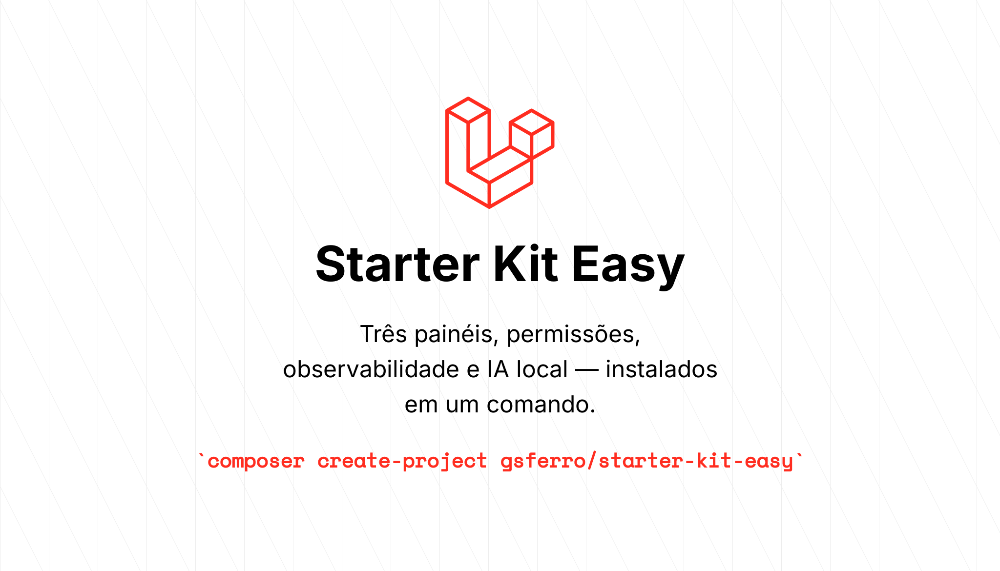
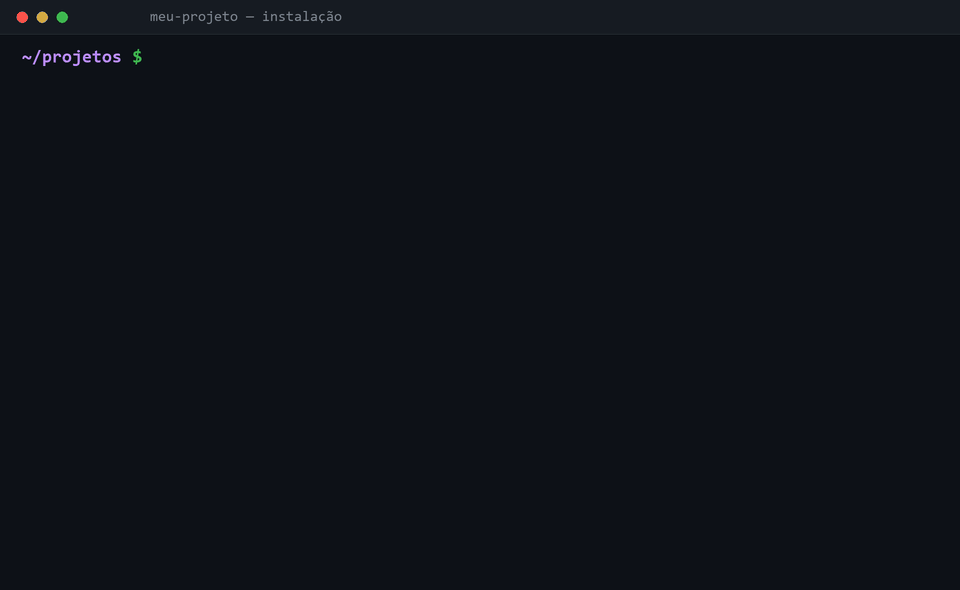
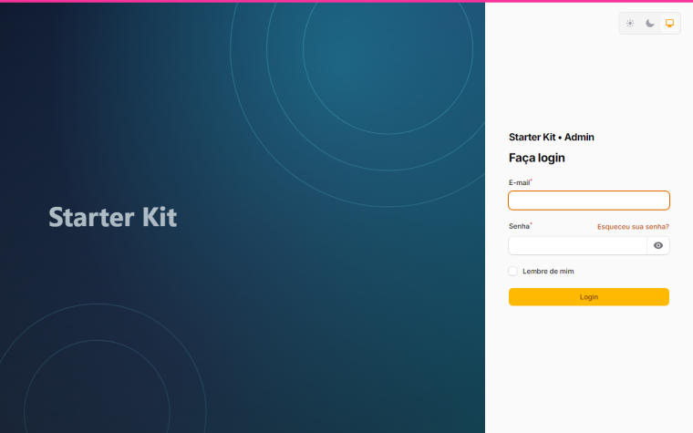
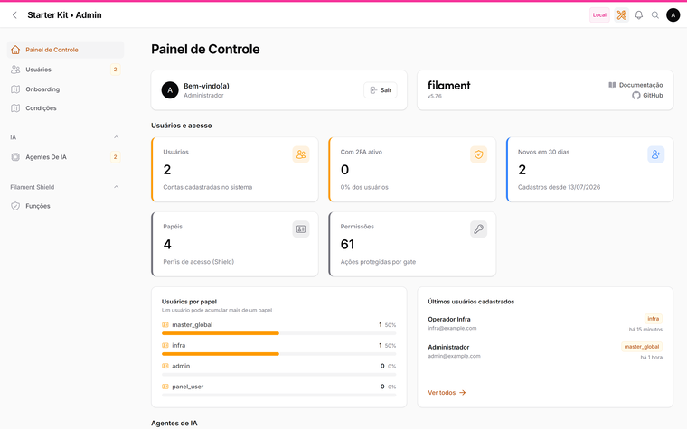
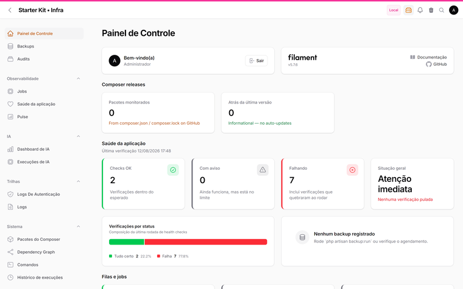
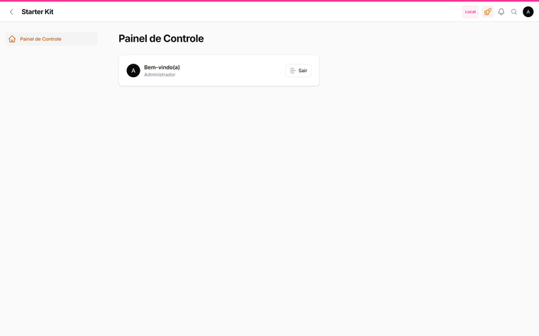

# starter-kit-easy



[](https://packagist.org/packages/gsferro/starter-kit-easy)
[](https://packagist.org/packages/gsferro/starter-kit-easy)
[](https://github.com/gsferro/filament-starter-kit-easy/actions/workflows/ci.yml)
[](https://packagist.org/packages/gsferro/starter-kit-easy)
[](LICENSE)

Starter kit **Laravel 13 + Filament 5** pronto para uso. Um comando cria o projeto, instala tudo, migra, popula o banco e entrega três painéis funcionando: **negócio**, **administração** e **infraestrutura**.

```bash
composer create-project gsferro/starter-kit-easy meu-projeto
cd meu-projeto
composer dev
```

Não há passo manual: o `create-project` já cria o `.env`, gera a `APP_KEY`, cria o banco SQLite, roda as migrations, semeia papéis/permissões/usuário, publica os assets do Filament e faz o build do front-end. Ao final ele imprime as URLs e o login inicial.



Prefere clonar? O mesmo instalador roda sozinho:

```bash
git clone https://github.com/gsferro/filament-starter-kit-easy.git meu-projeto
cd meu-projeto && rm -rf .git && git init   # descarta o histórico do kit
composer setup
```

## Acesso de demonstração

O seeder cria um usuário master que já entra nos três painéis:

| | |
|---|---|
| **Usuário** | `admin@example.com` |
| **Senha** | `password` |
| **Papel** | `master_global` (vence qualquer permissão via `Gate::before`) |

Entre por `/app`, `/admin` ou `/infra` — a mesma sessão vale para os três, e o menu do usuário troca de painel.

> ⚠️ **Troque a senha antes de expor o ambiente.** Para nascer com outra credencial, defina `KIT_ADMIN_EMAIL`, `KIT_ADMIN_PASSWORD` e `KIT_ADMIN_NAME` no `.env` **antes** de rodar a instalação (os valores ficam em `config/kit.php`). Num projeto já instalado, troque pelo próprio painel em `/admin/users` ou em **Meu perfil**.

Para testar o recorte de acesso, crie um usuário só com o papel `admin` ou `infra`: ele entra no painel correspondente e toma 403 no outro.

## Os três painéis

| Painel | URL | Para quê | Quem entra |
|---|---|---|---|
| **App** | `/app` | A operação do negócio. **Vem vazio de propósito** — é aqui que seu projeto nasce | qualquer usuário autenticado |
| **Admin** | `/admin` | Usuários, papéis e permissões (Shield), catálogo de agentes de IA, autoria de onboarding | `master_global`, `admin` |
| **Infra** | `/infra` | Health checks, backups, filas, logs, auditoria, caches, comandos, Pulse, custos de IA | `master_global`, `infra` |

A regra de acesso fica em `App\Models\User::canAccessPanel()`. O papel `master_global` vence qualquer gate via `Gate::before` (`App\Providers\KitServiceProvider`) — não precisa de permissions no banco.

Separar admin de infra é o ponto do kit: quem administra usuários não precisa (nem deve) enxergar logs, filas e comandos operacionais, e vice-versa.

### Como cada um se parece

| Login | Administração |
|---|---|
| [](art/login.png) | [](art/panel-admin.png) |
| Auth Designer em duas colunas — troque a arte em `public/images/auth/login.svg` | Usuários, papéis, agentes de IA e indicadores de administração |

| Infraestrutura | Negócio |
|---|---|
| [](art/panel-infra.png) | [](art/panel-app.png) |
| Saúde, filas, trilhas, comandos e custos de IA — agrupados por tema | Vazio de propósito: é onde o seu projeto nasce |

Mais telas: [saúde da aplicação](art/infra-health.png) · [permissões (Shield)](art/admin-roles.png) · [catálogo de agentes de IA](art/admin-agentes-ia.png) · [central de comandos](art/infra-comandos.png) · [busca ⌘K](art/spotlight.png) · [acesso negado](art/erro-403.png)

## O que já vem pronto

**Administração e segurança**
- Shield (papéis e permissões com UI) sobre spatie/laravel-permission
- Breezy: perfil do usuário, avatar, 2FA e passkeys
- Auth Designer: tela de login em duas colunas (troque a arte em `public/images/auth/login.svg`)
- Lockscreen: bloqueio de sessão por inatividade (30 min), registrado nos 3 painéis
- Impersonate, log de autenticação, auditoria de alterações (owen-it)
- Panel Switch: troca de painel pelo menu do usuário

**Observabilidade e manutenção (painel infra)**
- Spatie Health com checks de banco, cache, filas, agendador, disco, debug mode e IA local
- Backup Monitor (spatie/laravel-backup), Jobs Monitor, Logs Explorer (sem botão de apagar — trilha é evidência)
- Command Center: comandos Artisan pré-aprovados pela UI, com histórico
- Laravel Pulse embutido como página do painel
- Dependency Graph: mapa de models, relações, resources e painéis
- Release Notifier: avisa quando há versão nova dos pacotes Composer

**IA (opcional, local por padrão)**
- `laravel/ai` com catálogo de agentes no banco: system prompt, provider, modelo, tools e guardrails são **dados**, editáveis no `/admin` sem deploy
- Guardrails encadeados: budget, prompt injection, classificador local, redação de PII e filtro de saída sensível
- Ledger de execuções (`ai_runs`) com custo e tokens no painel infra
- Widget de chat com streaming
- Inferência 100% local via llama.cpp (`docker compose --profile ai up -d`) ou qualquer provider SaaS trocando `AI_PROVIDER`

**Produtividade**
- Busca ⌘K (Spotlight) com gatilho na topbar — as categorias do kit checam `canAccess()`, então ninguém encontra na busca uma tela que tomaria 403
- Badges de contagem animados no menu, centro de notificações com abas, indicador de ambiente
- Dashboards já preenchidos: stat cards com contador animado, funis, metas, breakdowns e timelines sobre os dados que os painéis já têm
- Páginas de erro brandadas (Sentinel) em pt-BR — a de 403 só mostra o diagnóstico de permissão fora de produção
- UI 100% em pt-BR e tabelas com defaults sensatos

## Requisitos

- PHP 8.3+ e Composer 2
- Node 20+ (opcional — sem ele a instalação segue e avisa como fazer o build depois)
- Docker (opcional — só para Postgres, Redis, IA local e e-mail)

## Banco de dados

O kit instala com **SQLite** para não depender de nada. Para Postgres, suba os containers e copie as variáveis:

```bash
docker compose up -d              # pgsql (com pgvector) + redis
# copie o bloco de banco de .env.docker para o seu .env
php artisan migrate --seed
```

## Docker

Tudo é opt-in por profile. Um container por feature:

```bash
docker compose up -d                            # pgsql + redis
docker compose --profile ai up -d               # + llama.cpp (chat e embeddings)
docker compose --profile mail up -d             # + mailpit (1025 / 8025)
docker compose --profile full up -d             # infra completa
docker compose --profile app up -d --build      # a aplicação containerizada
docker compose --profile realtime up -d reverb pulse
```

| Serviço | Porta | Profile |
|---|---|---|
| PostgreSQL 17 + pgvector | 5432 | base |
| Redis 7 (só cache) | 6379 | base |
| llama.cpp (chat) | 8080 | `ai` |
| llama.cpp (embeddings) | 8081 | `ai` |
| Mailpit | 1025 / 8025 | `mail` |
| App (nginx + php-fpm) | 8000 | `app` |
| Reverb (WebSocket) | 8090 | `app`, `realtime` |

O Reverb usa 8090 e não o default 8080 para não colidir com o llama.cpp.

## Comandos

```bash
composer dev          # servidor + fila + vite juntos
composer test         # pint + phpstan + a suíte inteira
composer test:kit     # só os testes do kit (a fundação)
composer lint         # formata o código
php artisan kit:install --force   # reinstala do zero (apaga o SQLite)
php artisan kit:update            # traz melhorias de uma versão nova do kit
```

### Os testes do kit

O kit traz sua própria suíte, isolada em `tests/Kit/` — acesso aos três painéis, telas de infra e admin de pé, invariantes da fundação (uuid, gates, auditoria) e o contrato da camada de IA.

Ela fica separada da sua de propósito: depois de um `kit:update` você quer saber se a **fundação** continua íntegra, sem esperar a suíte do seu negócio.

```bash
composer test:kit                     # atalho
php artisan test --testsuite=Kit      # equivalente
php artisan test --group=kit          # mesma coisa, por grupo do Pest
php artisan test --testsuite=Feature  # só os SEUS testes
```

Seus testes vão em `tests/Feature` e `tests/Unit`, como de costume — o kit não encosta neles.

## Personalize seu projeto

1. **Nome** — `APP_NAME` no `.env`
2. **Arte do login** — `public/images/auth/login.svg`
3. **Cores** — `->colors([...])` em cada `app/Providers/Filament/*PanelProvider.php`
4. **Acesso aos painéis** — `App\Models\User::canAccessPanel()`
5. **Matriz de permissões** — `database/seeders/PapeisSeeder.php`
6. **Health checks** — `KitServiceProvider::configureHealthChecks()`
7. **Comandos da UI** — `config/command-center.php`
8. **Credenciais do seeder** — `KIT_ADMIN_EMAIL` / `KIT_ADMIN_PASSWORD` no `.env`
9. **Backups** — destino e agenda em `config/backup.php`
10. **Agente de IA** — `/admin` → Agentes de IA (ou `database/seeders/AssistenteSeeder.php`)

## Configuração global do Filament

Um único arquivo define como **toda** tabela, toggle, modal e coluna do projeto se comporta: `app/Providers/Concerns/ConfiguraFilamentGlobal.php` (aplicado pelo `KitServiceProvider`). Mudou ali, mudou em todo lugar — inclusive nas telas dos plugins de terceiros, que você não conseguiria editar de outro jeito.

**Toda tabela nasce com:**

| Comportamento | Por quê |
|---|---|
| `deferLoading()` | a tela aparece antes da query terminar |
| `striped()` + `stackedOnMobile()` | leitura em lista no desktop, cartão no celular |
| `persistFilters/Search/Sort/ColumnSearchesInSession()` | o recorte do usuário sobrevive à navegação |
| `reorderableColumns()` + `dragReorderableColumns()` + `stickableColumns()` | colunas reordenáveis, arrastáveis e fixáveis |
| **colunas redimensionáveis** (`asmit/resized-column`) | largura ajustável pelo usuário, preservada na sessão |
| `filtersLayout(Modal)` + `filtersFormColumns(2)` + `deferFilters()` | com 3+ filtros o dropdown vira rolagem; o modal não |
| `defaultPaginationPageOption(10)` + `extremePaginationLinks()` | paginação previsível, com atalhos de primeira/última |
| `deselectAllRecordsWhenFiltered(false)` | filtrar não descarta a seleção |

Também são globais: modal que **não** fecha no Esc (um toque acidental descartaria o formulário), toggles com cor e ícone de estado, coluna de ícone booleana com check/x colorido, `CreateAction` com ícone padrão e o alternador de painéis.

> **Colunas redimensionáveis em telas novas:** o comportamento padrão já vale para qualquer tabela; para que a largura escolhida seja **lembrada**, a página de listagem precisa do trait:
>
> ```php
> use Asmit\ResizedColumn\HasResizableColumn;
>
> class ListProdutos extends ListRecords
> {
>     use HasResizableColumn;
> }
> ```

> 📌 **TODO:** transformar esses defaults num **Settings em `/admin`**, para que paginação, densidade, persistência de filtros e colunas redimensionáveis virem preferência do projeto pela interface, sem editar código. O `filament/spatie-laravel-settings-plugin` já está instalado para isso.

## Convenções do kit

- **UUID nas rotas, `id` int como PK.** Toda tabela nova ganha `$table->uuid('uuid')->unique()` e o model usa `App\Traits\TemUuid`. URL com id numérico devolve 404 e ninguém enumera registros por sequência. UUID não é autorização — policies continuam obrigatórias.
- **Auditoria no que é editável.** `App\Traits\AuditsFillables` audita exatamente o `$fillable`, sem vazar colunas técnicas para a trilha.
- **Seeder nunca usa factory nem faker.** `fakerphp/faker` é `require-dev` e a imagem Docker roda `--no-dev`.
- **Permissões vêm de seeder, não de `shield:generate` interativo** — é o que permite instalar sem intervenção. Depois de criar Resources novos, rode `php artisan db:seed --class=Database\\Seeders\\ShieldPermissionsSeeder`.

## Depois de criar seus Resources

```bash
php artisan make:filament-resource Produto --panel=app
php artisan db:seed --class=Database\\Seeders\\ShieldPermissionsSeeder
php artisan db:seed --class=Database\\Seeders\\PapeisSeeder
```

Na página de listagem gerada, adicione os dois traits do kit:

```php
use App\Filament\Concerns\BadgeContagemNavegacao;   // no Resource: badge de contagem no menu
use Asmit\ResizedColumn\HasResizableColumn;         // na List page: lembra a largura das colunas
```

## Atualizando um projeto que já nasceu do kit

**O kit é um ponto de partida, não uma dependência.** Depois do `create-project` o projeto é seu: você renomeia painéis, muda `canAccessPanel()`, edita seeders. Por isso **não existe** um `kit:update` que sobrescreve arquivos — ele reescreveria justamente o que você personalizou, e um starter kit que estraga o projeto do usuário não serve para nada.

O que muda separa-se em três camadas, e cada uma tem um caminho próprio:

| Camada | O que é | Como atualizar |
|---|---|---|
| **Dependências** | Filament, plugins, Laravel | `composer update` — é a maior parte das melhorias e chega sozinha |
| **Cola do kit** | providers, traits, widgets, views de erro | diff manual contra a tag nova (abaixo) |
| **Seu negócio** | tudo que você escreveu | nunca é tocado |

### O jeito fácil: `php artisan kit:update`

O comando automatiza a etapa do git inteira e **não aplica nada sem sua aprovação**:

```bash
php artisan kit:update --dry-run   # só mostra o que mudou
php artisan kit:update             # revisa e aplica, arquivo a arquivo
```

O que ele faz, em ordem:

1. **Confere o terreno** — exige repositório git com a árvore limpa. Sem isso não haveria como reverter, e ele recusa rodar (mostrando os comandos para versionar o projeto).
2. **Vincula o kit temporariamente** — adiciona o remote `kit` com **push bloqueado** e busca as tags num namespace próprio (`kit-v*`), para não colidirem com as versões do seu projeto.
3. **Compara** — da versão em `config('kit.version')` até a tag escolhida, restrito aos caminhos que pertencem ao kit. Seu código de negócio nunca entra na conta.
4. **Oferece um branch temporário** (`kit-update/v0.2.0`) para não sujar o seu.
5. **Pergunta arquivo a arquivo** — ver o diff, aplicar, pular ou parar. Dá para mudar de ideia no meio e aplicar o resto em lote. Arquivo removido do kit nunca é apagado automaticamente: ele só avisa.
6. **Desfaz o vínculo** — remove o remote e as tags `kit-*` ao sair, mesmo se você interromper no meio. O projeto não fica com nada de terceiros pendurado.

7. **Marca a versão aplicada** em `config/kit.php` — só aquela linha, sem tocar no resto do arquivo. É o ponto de partida da próxima comparação.

Dois detalhes que aparecem na prática:

- **`config/kit.php` sempre consta como "modificado"** (ele carrega a marca de versão). Aplicá-lo traz as chaves novas do kit, mas **substitui o arquivo inteiro** — se você mudou credenciais do seeder ou adicionou chaves próprias ali, veja o diff e copie só o que interessa em vez de aplicar.
- **O próprio `kit:update` se atualiza.** Como o PHP já carregou a classe em memória, o comportamento novo (e as mensagens novas) só valem a partir da execução seguinte. O comando avisa quando isso acontece.

Ao final nada está commitado: você revisa com `git diff`, roda `composer test:kit` (a fundação) e commita. Deu errado? `git checkout -- .` desfaz, ou apague o branch e volte para o seu.

**Não precisa aprovar 30 arquivos um a um.** Durante a revisão, o menu oferece *"Aplicar todos os arquivos NOVOS daqui em diante"* e *"Aplicar TUDO daqui em diante"* — uma confirmação vale para o conjunto. E dá para começar já em lote:

```bash
php artisan kit:update --only-new   # só o que ainda não existe no projeto
php artisan kit:update --all        # tudo, inclusive o que sobrescreve
```

A distinção é o ponto: **arquivo novo não tem o que sobrescrever**, então aplicá-los em massa é seguro — é o caso dos widgets, do Spotlight e das concerns. Já um **modificado** substitui o conteúdo atual, e se você editou aquele arquivo a sua versão se perde (recuperável com `git checkout -- <arquivo>`, já que nada é commitado). Por isso `--only-new` é o lote recomendado para a primeira passada, deixando os modificados para revisar com calma.

| Opção | Para quê |
|---|---|
| `--only-new` | aplica de uma vez só os arquivos novos (não sobrescreve nada) |
| `--all` | aplica tudo de uma vez, com uma confirmação para o conjunto |
| `--dry-run` | só o relatório, não altera nada |
| `--tag=v0.3.0` | comparar com uma versão específica |
| `--from=v0.1.0` | dizer de qual versão o projeto partiu (quando `config/kit.php` não sabe) |
| `--branch=nome` | escolher o nome do branch temporário |
| `--no-branch` | aplicar no branch atual |
| `--keep-remote` | manter o remote e as tags do kit ao final |

Sem terminal (CI, `--no-interaction`) o comando vira relatório e não altera nada — a menos que você passe `--only-new` ou `--all`, que **são** a aprovação, dada na linha de comando.

### O jeito manual

Se preferir controlar cada passo — ou entender o que o comando faz por baixo:

Adicione o kit como um **segundo remote**, uma única vez. Seu `origin` continua sendo o seu projeto; o `kit` é só uma fonte de leitura:

```bash
git remote add kit https://github.com/gsferro/filament-starter-kit-easy.git

# o remote do kit é somente-leitura: evita um `git push kit main` acidental
# mandar o SEU projeto para dentro do repositório do kit
git remote set-url --push kit no_push
```

As tags do kit vão para um namespace próprio (`kit-v*`). Isso importa: um `git fetch kit --tags` traria `v0.1.0`, `v0.2.0`… para o seu projeto e colidiria com as **suas** versões depois.

```bash
git fetch --no-tags kit 'refs/tags/*:refs/tags/kit-*'
git tag -l 'kit-*'      # kit-v0.1.0, kit-v0.2.0, ...
```

Depois, a cada versão, veja o que mudou e traga só o que interessa:

```bash
# 1. panorama entre a sua versão e a nova
git diff kit-v0.1.0..kit-v0.2.0 --stat

# 2. o diff da "cola" do kit (ignore o que você já reescreveu)
git diff kit-v0.1.0..kit-v0.2.0 -- app/Providers app/Filament/Concerns \
        app/Filament/Spotlight app/Traits resources/views/errors config/kit.php

# 3. traga arquivo a arquivo, revisando
git checkout kit-v0.2.0 -- resources/views/errors
git checkout kit-v0.2.0 -- app/Filament/Concerns/BadgeContagemNavegacao.php
```

Faça isso num branch (`git switch -c atualiza-kit`) e rode `composer test` antes do merge. Arquivos que você reescreveu: leia o diff e aplique à mão — é o único caminho seguro.

> 💡 **TODO / rumo do projeto:** extrair a "cola" para um pacote Composer próprio (`gsferro/kit-core`) com os providers, traits, widgets e páginas de infra. Aí a camada do meio vira `composer update gsferro/kit-core` e o skeleton fica mínimo — só o que é mesmo ponto de partida. É a evolução natural deste kit.

## Solução de problemas

- **`/infra` ou `/admin` dando 403** — seu usuário precisa do papel `master_global`, `admin` ou `infra`. A tela de 403 mostra qual permissão faltou, mas **só fora de produção**: em produção ela não revela papéis nem permissões.
- **Assets do Filament sumidos** — `php artisan filament:assets`.
- **Pulse sem dados** — falta o daemon: `php artisan pulse:check` (ou o serviço `pulse` do compose).
- **Sininho não atualiza em tempo real** — `BROADCAST_CONNECTION=reverb` exige o processo Reverb no ar; sem ele o kit cai para polling de 30s.
- **Assistente de IA indisponível** — suba `docker compose --profile ai up -d` (o primeiro boot baixa ~4,5 GB de modelo) ou troque `AI_PROVIDER` para um provider SaaS com API key.

## Licença

MIT.
