Every user account has **three states**, and they override access to any panel:

- **Active**: signs in with password or social login as usual.
- **Inactive**: the **password** or social login still recognises the account, but the user lands on a warning saying the account was **deactivated** and asking them to **contact the administrator** to **Reactivate**; no session is opened.
- **Deleted**: deletion is logical; anyone trying to sign in lands on a warning with the deletion date and, depending on the role, can **Restore** from the `/admin` user list or from the **Recycle bin** in `/infra`.

Users with the `Desativar:User` permission see the deactivate action in the `/admin` user list, and the `Reativar:User` permission sees the matching action. No one can deactivate their own account, and the system refuses to deactivate the last active `master_global`. The protection applies on **password** login, social login and link confirmation.

An unavailable account also **cannot be impersonated**: the *Impersonate* action does not appear on the row of anyone who is inactive, pending approval or deleted. It is the same rule as panel access — if the person cannot sign in on their own, nobody signs in as them.

## Account states

```mermaid
stateDiagram-v2
%% DG-08
accTitle: User account states
accDescr: Pending approves to Active (or Inactive, if it was deactivated before); Active and Inactive alternate by deactivate/reactivate; any of them can be deleted, and restoring goes back to the state from before deletion.
  Pendente --> Ativo : approve [was active]
  Pendente --> Inativo : approve [was deactivated]
  Ativo --> Inativo : deactivate [not own account / not the last active master_global]
  Ativo --> Excluida : delete
  Inativo --> Ativo : reactivate
  Inativo --> Excluida : delete
  Pendente --> Excluida : delete
  Excluida --> Ativo : restore [was active]
  Excluida --> Inativo : restore [was inactive]
  Excluida --> Pendente : restore [was pending]
  state "Pending" as Pendente
  state "Active" as Ativo
  state "Inactive" as Inativo
  state "Deleted" as Excluida
```

The "Pending" label hides `ativo`: a pending account can be deactivated without stopping being
Pending, and only when approved does it reveal whether it was active (goes to Active) or
deactivated (goes to Inactive) - that is why the condition sits on the `approve` arrow.
`rotuloDaSituacao()` returns Pending before Inactive before Active
(`app/Models/User.php:rotuloDaSituacao:501`, `:'Pendente':504`); `aprovar()` only clears the
pending flag, without touching `ativo` (`app/Models/User.php:aprovar:520`, `:526`); `desativar()`
refuses the own account and the last active `master_global`
(`app/Models/User.php:desativar:285`, `:propria_conta:349`, `:ultimo_master_global:350`); deletion
is logical (`SoftDeletes`) and overrides the Pending/Active/Inactive display
(`app/Models/User.php:SoftDeletes:85`); `restaurar()` returns the state saved before deletion.

