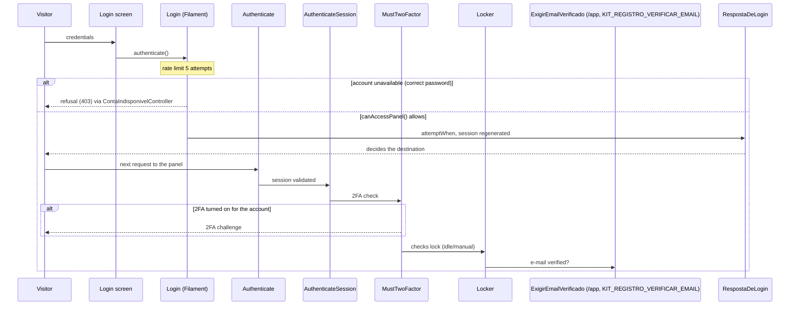
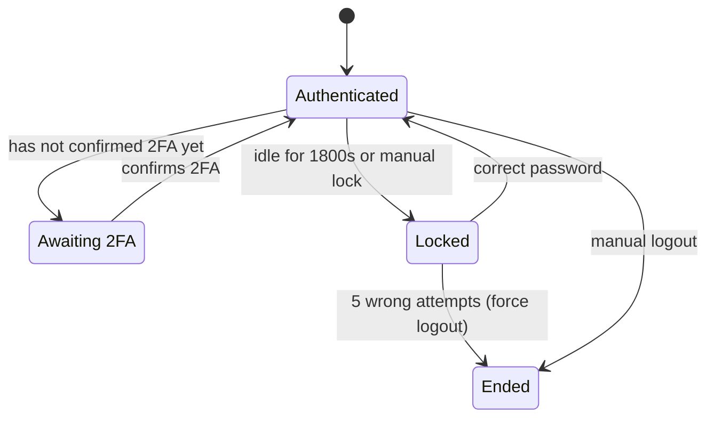

How someone gets in — and how someone stops getting in: invitation, open registration with
approval, social login across the four providers, the optional single login page (`/login`),
anti-robot protection, the three account states and what the public `/` route shows (and what it
deliberately does not).

The exact order of the panel access checks — unavailability, pending approval, `master_global`,
role — is in the [Panel access rule](../referencia/arquitetura-em-diagramas/) diagram (DG-03), on
the architecture diagrams page.

## Sequence: password login and 2FA

The kit's login screen intercepts the Filament failure only to explain an unavailable account
(`app/Filament/Pages/Auth/TelaLogin.php:authenticate:196`); the 5-attempt rate limit is Filament's
own (`vendor/filament/filament/src/Auth/Pages/Login.php:rateLimit(5):70`), which also decides with
`canAccessPanel()` (`vendor/filament/filament/src/Auth/Pages/Login.php:canAccessPanel:172`). The
login destination is always `app(LoginResponse::class)`, bound to `RespostaDeLogin`
(`app/Providers/KitServiceProvider.php:LoginResponse:838`). The next request's stack (real order,
checked with `php artisan route:list --json`) is `Authenticate` -> `AuthenticateSession` ->
`MustTwoFactor` -> `Locker` -> `ExigirEmailVerificado` (mandatory only on `/app`, with the key on).

## Authenticated session

The 2FA challenge only exists for whoever already confirmed it before — it is the same
`MustTwoFactor` from the diagram above. The idle lock uses `config('lockscreen.idle_timeout')` =
1800 (`config/lockscreen.php:idle_timeout:16`); the three panels share the same attempt limit with
forced logout (`app/Providers/Filament/AdminPanelProvider.php:enableRateLimit:267`,
`app/Providers/Filament/AppPanelProvider.php:enableRateLimit:381`,
`app/Providers/Filament/InfraPanelProvider.php:enableRateLimit:290`).
