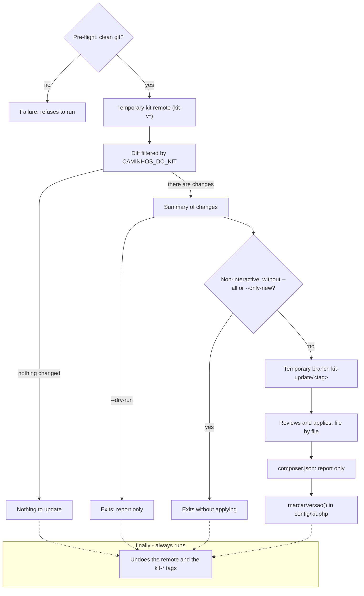
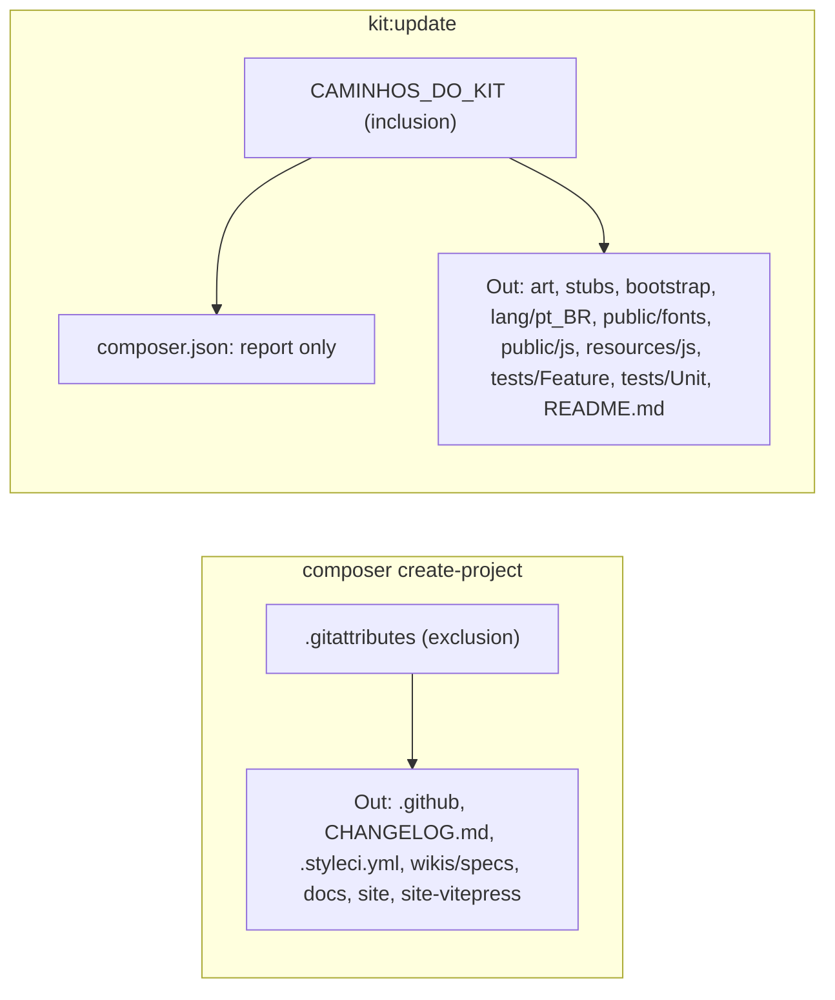

**The kit is a starting point, not a dependency.** After `create-project` the project is yours: you rename panels, change `canAccessPanel()`, edit seeders. That's why there is **no** `kit:update` that overwrites files — it would rewrite exactly what you customized, and a starter kit that ruins the user's project is worth nothing.

What changes splits into three layers, and each one has its own path:

| Layer | What it is | How to update |
|---|---|---|
| **Dependencies** | Filament, plugins, Laravel | `composer update` — it's most of the improvements and it arrives on its own |
| **The kit's glue** | providers, traits, widgets, error views | manual diff against the new tag (below) |
| **Your business** | everything you wrote | never touched |

## The easy way: `php artisan kit:update`

The command automates the entire git step and **applies nothing without your approval**:

```bash
php artisan kit:update --dry-run   # only shows what changed
php artisan kit:update             # review and apply, file by file
```

What it does, in order:

1. **Checks the ground** — requires a git repository with a clean tree. Without that there would be no way back, so it refuses to run (showing the commands to put the project under version control).
2. **Links the kit temporarily** — adds the `kit` remote with **push blocked** and fetches the tags into a namespace of their own (`kit-v*`), so they don't collide with your project's versions.
3. **Compares** — from the version in `config('kit.version')` up to the chosen tag, restricted to the paths that belong to the kit. Your business code never enters the equation.
4. **Offers a temporary branch** (`kit-update/v0.16.0`) so yours doesn't get dirty.
5. **Asks file by file** — see the diff, apply, skip or stop. You can change your mind halfway and apply the rest in bulk. A file removed from the kit is never deleted automatically: it only warns you.
6. **Unlinks** — removes the remote and the `kit-*` tags on the way out, even if you interrupt it halfway. The project isn't left with anything third-party hanging around.

7. **Marks the applied version** in `config/kit.php` — only that line, without touching the rest of the file. It's the starting point for the next comparison.

The flow is **non-interactive** when there is no terminal (CI, `--no-interaction`) — never "no
TTY": it turns into a report and exits without applying anything, unless `--all` or `--only-new`
already gave the approval on the command line
(`app/Console/Commands/KitUpdate.php:isInteractive:449`).



The order comes straight from `KitUpdate::handle()`
(`app/Console/Commands/KitUpdate.php:handle:397`): pre-flight (`:preVoo:485`), temporary remote
(`:vincularKit:545`), restricted diff (`:arquivosAlterados:651`), summary (`:mostrarResumo:826`),
the terminal check (`:isInteractive:449`), the temporary branch (`:prepararBranch:846`), the
file-by-file review (`:revisarEAplicar:895`), the `composer.json` report
(`:relatarComposerJson:1080`, `:CAMINHOS_SO_RELATORIO:388`) and `marcarVersao()`
(`:marcarVersao:1189`, called inside `:encerrar:1114`). The `finally` that undoes the remote runs on
every exit path, including errors (`:desvincularKit:554`).

Two details that show up in practice:

- **`config/kit.php` always shows up as "modified"** (it carries the version mark). Applying it brings the kit's new keys, but **replaces the whole file** — if you changed seeder credentials or added your own keys there, read the diff and copy only what matters instead of applying.
- **`kit:update` updates itself.** Since PHP already loaded the class into memory, the new behavior (and the new messages) only take effect on the following run. The command tells you when that happens. The **path list** that filters the diff is read from the **target version** (since v0.30.1), so a directory only the new version covers arrives in the same run — the "run the command again" notice only appears when that read failed. **An installation older than v0.30.1** still runs the old list on its first pass: run the second one with the command the notice prints. The known case is v0.22.x → v0.23.0 or later, which left `View [svg.arte-do-login] not found` between the two runs; the second run fixes it, or copy `resources/views/svg/arte-do-login.blade.php` from the kit repository.

### A new kit dependency: `composer.json` is never applied

`kit:update` **does not overwrite your `composer.json`** — it carries YOUR project's dependencies,
and applying it would wipe out everything you installed after the kit. Instead the command
**reports** what changed there (new package, new script) and you copy it by hand:

```bash
git diff kit-v0.35.0 kit-v0.36.0 -- composer.json
composer update
php artisan filament:assets   # required whenever the new package publishes CSS/JS
```

> **The report only shows up when the command knows where you started from.** It reads
> `config('kit.version')`; if that marker does not match a kit tag, pass `--from=vX.Y.Z`.

**In v0.36.0 this applies to `mortalkiller/filament-page-header`**, which brings the rich header on
record screens and publishes its own CSS and JS. Without `composer require` + `filament:assets`,
the View/Edit screens for users and organizations still answer — just without the header.

### A new screen: reseed both seeders

The "next steps" the command prints mention `filament:assets` and the tests, **not the seeders** —
and a new kit screen usually brings a new permission, which lands ownerless in your database:

```bash
php artisan db:seed --class=Database\Seeders\ShieldPermissionsSeeder
php artisan db:seed --class=Database\Seeders\PapeisSeeder
```

Both are idempotent — running them again duplicates nothing.

**In v0.36.0 specifically they are a no-op** — and it is worth knowing why, so you don't go hunting
for a defect that isn't there. The `ViewUser` screen that version brings consumes the `View:User`
permission, and that permission **was already generated and handed out all along**: `view` is in
`config('filament-shield.policies.methods')`, so `ShieldPermissionsSeeder` always created it and
`PapeisSeeder` always gave it to the roles. Between v0.35.0 and v0.36.0 neither the seeders nor
`config/filament-shield.php` changed a line (`git diff v0.35.0 v0.36.0 -- database/seeders
config/filament-shield.php` comes back empty). What was missing was the **screen**, not the
permission: the checkbox in `/admin/shield/roles` existed and decided nothing.

Run both anyway. The habit costs two idempotent commands and pays off on the version that does
bring a genuinely new Resource or Page — there the permission really is born ownerless in your
database, and the symptom is a screen nobody can see.

At the end nothing is committed: you review with `git diff`, run `php artisan migrate` if a new migration arrived (from v0.31.0 on the command also delivers `database/settings/`, and the settings screen breaks while the new property has no row in the database), run `composer test:kit` (the foundation) and commit. Went wrong? `git checkout -- .` undoes it, or delete the branch and go back to yours.

- **The settings screen's URL changed in v0.32.0.** It now answers at
  `/admin/configuracoes-da-aplicacao`, the name it already showed in the menu. The old slug returns
  a **301** to the new one, so old bookmarks and links still arrive. If your project wrote the old
  address by hand somewhere — a test, a link in one of your views, a bookmarklet —, update it; the
  permission (`View:ConfiguracoesDoKit`) and the class did not change, only the slug.
**You don't have to approve 30 files one by one.** During the review the menu offers *"Apply all NEW files from here on"* and *"Apply EVERYTHING from here on"* — one confirmation covers the set. And you can start in bulk already:

```bash
php artisan kit:update --only-new   # only what doesn't exist in the project yet
php artisan kit:update --all        # everything, including what overwrites
```

The distinction is the point: **a new file has nothing to overwrite**, so applying those in bulk is safe — that's the case for the widgets, the Spotlight, the concerns, the kit's CSS (`resources/css/filament/` and `public/css/kit/`, delivered from v0.30.0 on) and the Settings migrations (`database/settings/`, from v0.31.0 on). The **`.env.example`** is delivered too (from v0.32.2 on): it is a suggestion file, it is where the kit documents every new key, and your `.env` is never touched — but it arrives as **modified**, so review the diff if you added keys of your own to it. A **modified** one replaces the current content, and if you edited that file your version is lost (recoverable with `git checkout -- <file>`, since nothing is committed). That's why `--only-new` is the recommended bulk for a first pass, leaving the modified ones to review calmly.

| Option | What for |
|---|---|
| `--only-new` | applies all the new files at once (overwrites nothing) |
| `--all` | applies everything at once, with a single confirmation for the set |
| `--dry-run` | report only, changes nothing |
| `--tag=v0.16.0` | compare against a specific version |
| `--from=v0.15.0` | tell it which version the project started from (when `config/kit.php` doesn't know) |
| `--branch=name` | choose the temporary branch's name |
| `--no-branch` | apply on the current branch |
| `--keep-remote` | keep the kit's remote and tags at the end |
| `--repo=URL` | compare against another kit repository (a fork, for instance); the default is `config('kit.repository')`, which reads `KIT_REPOSITORY` from `.env` |

With no terminal (CI, `--no-interaction`) the command becomes a report and changes nothing — unless you pass `--only-new` or `--all`, which **are** the approval, given on the command line.

## The two delivery routes

The kit reaches your project in two ways, and each one delivers a different slice of the tree.
`composer create-project` brings **everything `.gitattributes` does not exclude**
(`.gitattributes:/docs export-ignore:40`, `.gitattributes:/site export-ignore:46`,
`.gitattributes:/wikis/specs export-ignore:32`, `.gitattributes:/.github export-ignore:20`);
`kit:update` brings **only the paths in `CAMINHOS_DO_KIT`**
(`app/Console/Commands/KitUpdate.php:CAMINHOS_DO_KIT:93`), with `composer.json` as the exception —
it travels on `create-project`, but on `kit:update` it is **report only**, never applied (the
section above, "A new kit dependency").

A path that **entered** `CAMINHOS_DO_KIT` after your version — such as the authored folders under
`resources/views/vendor` — is compared against **your tree**, not only tag against tag
(`app/Console/Commands/KitUpdate.php:caminhosNovosNaLista:692`): the file you do not have shows up as
"novo no kit" even if the kit has not changed it since your version, and a file your project does not
have shows up as "novo no kit" even if the kit changed it between the tags — that is the label `--only-new`
applies. This behaviour holds from the version that introduced it (the class that runs is the installed
one): on the **first** round from an earlier version, a view you do not have may show up as
"modificado" — apply it in interactive mode or with `--all`, not with `--only-new`, and run again.



A directory listed **only in part** is never drawn as delivered whole: `app/Models` in
`kit:update` is only the kit's 7 files, one by one
(`app/Console/Commands/KitUpdate.php:'app/Models/User.php':118`), never a model you add later — and
`config/` is only five named files
(`app/Console/Commands/KitUpdate.php:'config/kit.php':153`). And `wikis/` is **not** `export-ignore`
as a whole — only `wikis/specs` is: `wikis/`'s top-level documents travel on `create-project` **and**
`kit:update` delivers them one by one
(`app/Console/Commands/KitUpdate.php:'wikis/README.md':322`), just like `tests/Kit` and
`tests/Pest.php`
(`app/Console/Commands/KitUpdate.php:'tests/Kit':245`, `app/Console/Commands/KitUpdate.php:'tests/Pest.php':264`)
— `tests/` is not "untouched by kit:update".

## The manual way

If you'd rather control every step — or understand what the command does under the hood:

Add the kit as a **second remote**, once. Your `origin` stays your project; `kit` is just a read source:

```bash
git remote add kit https://github.com/gsferro/filament-starter-kit-easy.git

# the kit's remote is read-only: it prevents an accidental `git push kit main`
# from sending YOUR project into the kit's repository
git remote set-url --push kit no_push
```

The kit's tags go into a namespace of their own (`kit-v*`). That matters: a `git fetch kit --tags` would bring `v0.15.0`, `v0.16.0`… into your project and collide with **your** versions later.

```bash
git fetch --no-tags kit 'refs/tags/*:refs/tags/kit-*'
git tag -l 'kit-*'      # kit-v0.15.0, kit-v0.16.0, ...
```

Then, at each version, see what changed and bring over only what matters:

```bash
# 1. overview between your version and the new one
git diff kit-v0.15.0..kit-v0.16.0 --stat

# 2. the diff of the kit's "glue" (ignore what you already rewrote)
git diff kit-v0.15.0..kit-v0.16.0 -- app/Providers app/Filament/Concerns \
        app/Filament/Spotlight app/Traits resources/views/errors config/kit.php

# 3. bring it over file by file, reviewing
git checkout kit-v0.16.0 -- resources/views/errors
git checkout kit-v0.16.0 -- app/Filament/Concerns/BadgeContagemNavegacao.php
```

Do this on a branch (`git switch -c update-kit`) and run `composer test` before merging. Files you rewrote: read the diff and apply by hand — it's the only safe path.

> 💡 **TODO / where the project is heading:** extract the "glue" into a Composer package of its own (`gsferro/kit-core`) with the providers, traits, widgets and infra pages. Then the middle layer becomes `composer update gsferro/kit-core` and the skeleton stays minimal — only what really is a starting point. It's this kit's natural evolution.

