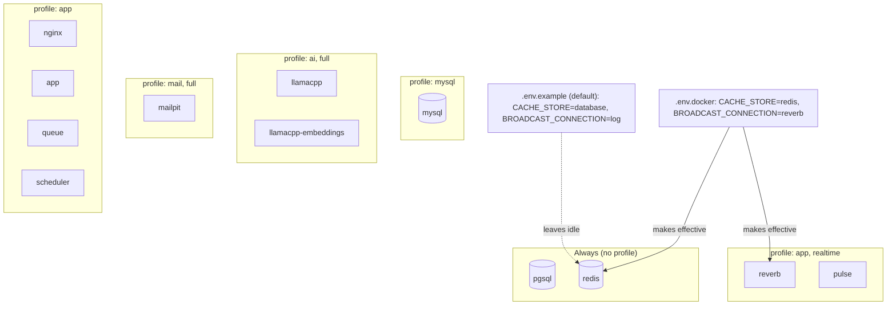
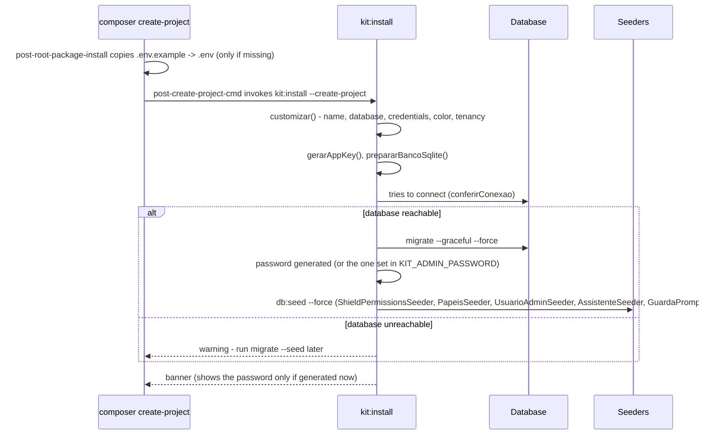

## Database

**The installation asks** — SQLite, PostgreSQL or MySQL. The default is **SQLite**, so it depends on nothing.

**PostgreSQL is the recommended one**, for a functional reason: it is the only one shipping `pgvector`, which the local AI features that use semantic search (embeddings) depend on. With SQLite or MySQL the rest of the kit runs the same — only those features are unavailable.

If you pick Postgres during installation, the `.env` already comes with the block `docker-compose.yml` reads. If the container is not up at that moment, the kit warns you, **skips the migrations** and prints the command to finish:

```bash
docker compose up -d
# set KIT_ADMIN_PASSWORD in the .env BEFORE seeding — without it the admin is born with the published password
php artisan migrate --seed
```

Container already created and you changed the `.env` (a new `KIT_ADMIN_PASSWORD`, say)? `docker compose up -d` does **not** re-read the file — `env_file` is only loaded when the container is CREATED. For the value to actually land, recreate it:

```bash
docker compose up -d --force-recreate
php artisan migrate --seed
```

To switch after the installation, bring the containers up and copy the variables:

```bash
docker compose up -d --force-recreate   # pgsql (with pgvector) + redis, re-reading the .env
# copy the database block from .env.docker into your .env
php artisan migrate --seed
```

### MySQL ships a container too

If you pick MySQL, the `.env` comes pointing at `127.0.0.1:3306` with user `root`, and the kit
brings the server up for you. The command differs from the Postgres one, and the reason matters:

```bash
docker compose up -d mysql redis
php artisan migrate --seed
```

MySQL is the **only database in a profile of its own**, because the installation picks a single
database — leaving it profile-less would make every install bring Postgres and MySQL up together.
Naming the services on the command line enables the MySQL profile **and** restricts the run to what
was named, so the default-profile Postgres stays down. That is why `redis` has to be written there:
naming services turns off the rest of the default set along with it.

Two details of the image, which explain what the installer writes:

- **The user is `root`.** The official image refuses to create `root` through `MYSQL_USER` — keeping
  that user, the only way is the root password.
- **The password is not empty.** `mysql:8.0` refuses to initialize without a root password, and the
  installer writes `secret`, the same one the container reads. Bringing your own server, adjust
  `DB_PASSWORD` in the `.env` — just as you already would with an external Postgres.

- **The host port is `FORWARD_MYSQL_PORT`**, defaulting to 3306, not Postgres' `FORWARD_DB_PORT`.
  They are separate keys because under the `app` profile both databases come up together, and a
  single variable would make them fight over the same port. If a MySQL is already running on your
  machine, Docker refuses with `Bind for 0.0.0.0:3306 failed: port is already allocated` — change
  the key:

  ```bash
  FORWARD_MYSQL_PORT=3399 docker compose up -d mysql redis
  ```

  and point `DB_PORT` in the `.env` at the same port.

The local AI caveat does not change: semantic search and embeddings depend on `pgvector`, which only
Postgres has.

## Local domain at the end of the installation

Once the heavy lifting is done — migrations, seeders and assets —, `kit:install` asks one last
question: **register a local domain**, so the project opens at `http://my-project.test` instead of
`http://localhost:8000`.

```text
Cadastrar um domínio local (ex.: http://my-project.test)? [y/N]
Qual domínio? › my-project.test
```

Three things are worth knowing before you answer:

- **It is opt-in.** The default answer is *no*: Enter keeps `http://localhost:8000`, exactly as
  before. The question only shows up when there is a terminal — in CI, a Docker build or with
  `--no-interaction` the step never happens. There is no flag to turn it on or off, and it does not
  depend on `--force` either.
- **The suggestion comes from the name you chose** in the first question: `Loja do Ferro` becomes
  `loja-do-ferro.test`. You can type another one — with no `http://`, no slash and no space, and
  within the DNS limits (63 characters per label, 253 overall). The suffix is `.test`, reserved by
  RFC 6761; `.local` is refused, because RFC 6762 reserves it for mDNS.
- **A public domain takes one more yes.** If what you type does not end in `.test`, `.localhost`,
  `.example` or `.invalid` — the four suffixes RFC 6761 reserves for local use —, the command asks
  a third question, naming the domain and spelling out what is about to happen. The default answer
  is *no*, for a concrete reason: pointing a real domain at `127.0.0.1` **blocks access to the
  actual site on this machine**, and the line stays in `hosts` until someone removes it by hand —
  removing is not part of what `kit:install` does. It is the guard against the typo that costs the
  most. (The prompts themselves are in Portuguese, as everywhere else in the installer.)
- **Accepting does two things**: a `127.0.0.1` line is appended to the machine's `hosts` file, and
  the `APP_URL` key in your `.env` becomes `http://my-project.test` — which is the address the
  command itself prints at the end, already with the new name.

On **Windows** the step runs the registration, asking for elevation through UAC: a window opens,
and what decides whether it worked is the kit **reading the file back** afterwards — the exit code
of an elevated process proves nothing. On **Linux** and **macOS** it prints the line ready for you
to paste with `sudo`, and adjusts `APP_URL` all the same.

None of this aborts the installation — not even a question interrupted halfway through. Elevation
denied, an antivirus guarding the file or a missing `pwsh` all become a **warning** at the end, with
the command ready to paste (the one for *your* system: `Start-Process … -Verb RunAs` on Windows,
`sudo tee -a` on Linux and macOS). The warning also states **what happened to `APP_URL`**: normally
it is left alone, so the final screen never shows an address that does not answer.

If the domain already resolves **to this machine** — an earlier installation, or Laravel Herd and
Valet, which answer for `*.test` on their own —, the `hosts` file is left untouched and only
`APP_URL` is adjusted. Mind the "to this machine": only `127.0.0.0/8` and `::1` count. A corporate
wildcard DNS answers for any name, including one you have just made up, and treating that as "already
done" would leave the final screen pointing at somebody else's server. In that case the command says
which address answered and registers the local line on top of it.

The full manual recipe, with the elevation traps, `FORWARD_APP_PORT` and the effect on social login
and Vite, is in [Local domain](../dominio-local/).

## Container names

No service in `docker-compose.yml` declares a `container_name`. The prefix of every container and
every network comes from `COMPOSE_PROJECT_NAME`, in the `.env`, and `kit:install` writes your chosen
name there — lowercased and hyphenated, which is the format Compose accepts:

```bash
$ docker compose ps
minha-app-pgsql-1
minha-app-redis-1
```

Without that key, `starter-kit` applies — the floor written in `docker-compose.yml` itself.

Two practical points:

- **A project born from an earlier version of the kit** does not get the key through `kit:update`,
  which never touches `.env`. Run `php artisan kit:install --custom`, which redoes name and colour,
  or add the line by hand.
- **Changing the name after containers are already up creates new volumes.** The old data stays in
  the volume under the previous name; migrate it first, or change the name before the first `up`.

## The containerized application and the database

The `app` profile brings the whole application up in a container. It talks to Postgres by default;
to point it at MySQL, set in the `.env`:

```
DOCKER_DB_SERVICE=mysql
```

and enable both profiles together, otherwise the database container never starts and the host does
not exist:

```bash
docker compose --profile app --profile mysql up -d --build
```

One honest caveat: in that combination an idle Postgres container comes up, because the `app`
profile services depend on it to order the boot. The alternative was measured and is worse — without
that dependency, `docker compose --profile app up -d` brings the application up with **no database at
all**, and without an error.

## Containers by profile

The 12 services in `docker-compose.yml` come up in groups: `pgsql` and `redis` always, with no
profile (`docker-compose.yml:pgsql::29`, `docker-compose.yml:redis::85`); `mysql` in its own
profile, started by name — `docker compose up -d mysql redis`, never by the profile alone, which
would bring `pgsql` along (`docker-compose.yml:profiles: [mysql]:55`); `llamacpp` and
`llamacpp-embeddings` with `ai` or `full` (`docker-compose.yml:profiles: [ai, full]:106`); `mailpit`
with `mail` or `full` (`docker-compose.yml:profiles: [mail, full]:164`); `nginx`, `app`, `queue` and
`scheduler` with `app` (`docker-compose.yml:profiles: [app]:180`); and `reverb` and `pulse` with
`app` or `realtime` (`docker-compose.yml:profiles: [app, realtime]:335`).



The `.env.example` the installation uses by default does **not** actually turn `redis` or `reverb`
on — the cache stays on `database` and the broadcast on `log` (`.env.example:CACHE_STORE:54`,
`.env.example:BROADCAST_CONNECTION:50`). The two containers are only read once `.env.docker` is in
place (`.env.docker:CACHE_STORE:27`, `.env.docker:BROADCAST_CONNECTION:63`), the same file the
previous section uses for the `app` profile.

## Commands

```bash
composer dev          # server + queue + vite + reverb together (and pail, off Windows)
composer test         # pint + phpstan + filacheck + the whole suite
composer test:kit     # only the kit's tests (the foundation), in parallel
composer lint         # formats the code
composer lint:check   # only checks the formatting, changing nothing (what CI runs)
composer filament:check   # only the Filament-specific lint (FilaCheck)
composer refactor:preview # what Rector would rewrite (dry-run) — OUTSIDE composer test
composer refactor:apply   # applies Rector's rewrite — OUTSIDE composer test
composer upgrade:filament # runs vendor/bin/filament-v5 (filament/upgrade is already in require-dev)
php artisan kit:install --force   # reinstalls from scratch (deletes the SQLite file) and asks again
php artisan kit:install --custom   # redoes only name and colour, without touching the database
php artisan kit:install --no-custom   # installs without asking anything
php artisan kit:install --no-npm      # skips installing and building the front-end assets
php artisan kit:install --no-seed     # doesn't seed the database (roles, initial user, AI agents)
php artisan kit:install --no-support  # skips the invitation to star the kit on GitHub
#   --create-project is internal to post-create-project-cmd: removes what only serves the kit's own repository
php artisan kit:admin             # changes the administrator's e-mail and password (asks for confirmation)
php artisan kit:admin --email=x --senha=y --force   # no prompts — avoid it: the password lands in the shell history
php artisan kit:info              # shows how the project is customized and where each value comes from
php artisan kit:update            # brings in improvements from a new kit version
php artisan kit:tenancy           # turns on multi-tenancy (opt-in)
```
The quality deep dives that used to sit under this section — FilaCheck, Rector, the test suite,
the README images and the SFDIPOT sweep — are in
[Code quality](../../referencia/qualidade-de-codigo/).

## Customize your project

**The installer already asks the first five** — the list below is for changing them later, or for whoever skipped the questions.

`php artisan kit:info` shows the current value of every item below, and whether it comes from the database or the `.env`.

| # | What | Where | Asked during installation? |
|---|---|---|---|
| 1 | **Name** | `APP_NAME` in `.env` | ✅ |
| 2 | **Database** | the `DB_*` block in `.env` | ✅ |
| 3 | **Seeder credentials** | `KIT_ADMIN_EMAIL` / `KIT_ADMIN_PASSWORD` in `.env` | ✅ |
| 4 | **Primary color** | `KIT_COR_PRIMARIA` in `.env` (a color name from the Filament palette), or `KIT_COR_PRIMARIA_HEX` with a free hex value — the hex beats the name when both are filled | ✅ |
| 5 | **[Multi-tenancy](../../recursos/multi-tenancy/)** | `php artisan kit:tenancy`, and the displayed term in `config/kit.php` → `tenancy.label` | ✅ |
| 6 | **Login artwork** | none: it **shows the application name** (`APP_NAME`) on its own. To replace it with your own image, upload it at `/admin/configuracoes-da-aplicacao` | ✅ (via the name) |
| 7 | **Panel access** | each user's role (`/admin` → Roles, the *Painel* field); the rule that reads it is `App\Models\User::canAccessPanel()` | — |
| 8 | **Permission matrix** | `database/seeders/PapeisSeeder.php` | — |
| 9 | **Health checks** | `KitServiceProvider::configureHealthChecks()` | — |
| 10 | **Commands in the UI** | `config/command-center.php` | — |
| 11 | **Backups** | destination and schedule in `config/backup.php` | — |
| 12 | **AI agent** | `/admin` → AI Agents (or `database/seeders/AssistenteSeeder.php`) | — |
| 13 | **[Panel languages](../../referencia/busca-e-idioma/#the-language-switcher)** | `config/kit.php` → `idiomas` (a list of locales; with only one, the switcher doesn't show) | — |
| 14 | **[Trail retention](../../recursos/trilhas-de-infraestrutura/#retention-the-number-is-the-intent-the-scheduler-is-the-execution)** | `KIT_RETENCAO_EXCECOES_DIAS` / `KIT_RETENCAO_EMAILS_DIAS` in `.env` | — |
| 15 | **[Media disk](../../recursos/anexos-e-midia/)** | `MEDIA_DISK` in `.env` (`local` by default — private, served through a signed URL) | `php artisan kit:midia-privada` migrates media already written to a public disk |
| 16 | **[CSV import and export](../../recursos/import-export-csv/)** | the Action in each `app/Filament/**/Pages/List*.php` (on or commented out); the permission in `config/filament-shield.php` → `policies.methods`; history retention in `KIT_RETENCAO_IMPORTACOES_DIAS` / `KIT_RETENCAO_EXPORTACOES_DIAS` in `.env` | reseed `ShieldPermissionsSeeder` + `PapeisSeeder` after touching the config |

The last eleven are not asked because they are **code or screen data**, not a value that fits in a terminal prompt. The installer lists them in the final summary, each with its file.

> ⚠️ Item 5 is the only one that is **not** "edit a file" once installed: `kit:tenancy` runs `migrate:fresh --seed` and **deletes your data**. It requires a clean git tree and an explicit confirmation. **Answered during installation it deletes nothing** — the database does not exist yet, and that is the right moment to decide.

> The primary color applies to all three panels. With [multi-tenancy](../../recursos/multi-tenancy/) on, each organization's color **wins** over it inside `/app/{slug}` — `/admin` and `/infra` keep the project's one. For a full palette, and not just `primary`, the way is still `->colors([...])` in each `app/Providers/Filament/*PanelProvider.php`.

## How the installation works under the hood

`composer create-project` runs two of the kit's own scripts
(`composer.json:post-root-package-install:204`, `composer.json:post-create-project-cmd:207`): the
first only copies `.env.example` to `.env` if it does not exist yet; the second calls
`php artisan kit:install --create-project`. Inside `KitInstall::handle()`
(`app/Console/Commands/KitInstall.php:handle:81`), the real order is: the five customization
questions (`app/Console/Commands/KitInstall.php:customizar():108`) come before generating the
`APP_KEY` and preparing SQLite; migrating and seeding only happen **if the database answers**
(`app/Console/Commands/KitInstall.php:if ($this->bancoAcessivel):113`,
`app/Console/Commands/KitInstall.php:if ($this->bancoAcessivel && ! $this->option('no-seed')):117`);
and the administrator password is generated **before** `db:seed`
(`app/Console/Commands/KitInstall.php:garantirSenhaDoAdministrador:376`,
`app/Console/Commands/KitInstall.php:'db:seed':392`) — never the other way around, or the banner
would print a password the seeder had already recorded as something else.



The order of the five seeders comes from `DatabaseSeeder::run()`
(`database/seeders/DatabaseSeeder.php:run:16`) — `TenantsSeeder` runs after them, only with
multi-tenancy on. The banner never prints `password`: the password is generated with 24
alphanumeric characters and only shows up once, in the run that created it
(`app/Support/SenhaDoAdministrador.php:garantirNoEnv:149`); whoever already set their own in
`KIT_ADMIN_PASSWORD` never sees it printed back.

