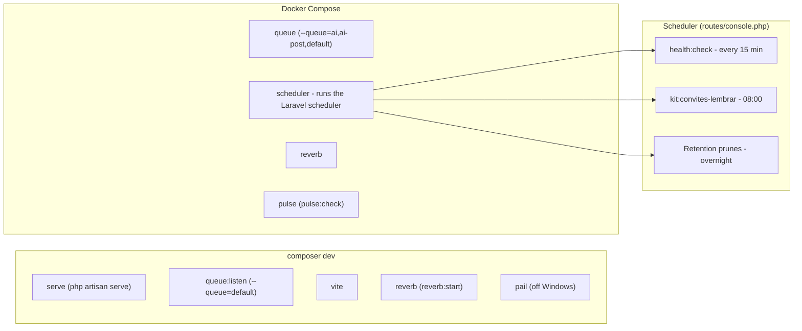

This section is for people who **work on the kit**, not for people who installed it. None of it
is needed in a project born from `create-project`.

## Private tooling stays OUT of the published package

`filament/blueprint` is a paid package living in a private repository. It helps evolve the kit,
which is why it **never** enters the committed state. The reason is harder than "good practice":

`composer create-project` installs **dev** dependencies by default — its own `--help` says
*"Enables installation of require-dev packages (enabled by default)"* — and it does so **before**
running `post-create-project-cmd`. With Blueprint in the published `composer.json` or
`composer.lock`, anyone without a licence gets a **403** while dependencies resolve, and the kit
becomes **uninstallable**. The hook that would clean it up never runs.

That is why Blueprint is not "removed on install", unlike the Snyk binding (an inert file the
installer deletes). It goes in and out through a script, and the committed state is always off:

```bash
composer bp:on    # declares the repository and requires it as a dev dependency
composer bp:off   # removes both the package and the repository
```

The credential goes into the **global** `auth.json`, which does not exist inside the project:

```bash
composer config --global --auth http-basic.packages.filamentphp.com "<your-email>" "<your-token>"
```

The token comes from your Filament account. The local `/auth.json` is in `.gitignore` as a last
line of defence, but global is better: the file does not even exist there for someone to commit
with `git add -f`.

`tests/Kit/BlueprintForaDoPacoteTest.php` guards this. **With Blueprint enabled those cases go
red** — deliberately: it is the reminder to run `composer bp:off` before committing.


## How the documentation site is published

This site — <https://gsferro.github.io/filament-starter-kit-easy/> — is the content of `docs/`
built by **Astro Starlight** and published by **GitHub Actions**. The whole update cycle is:

1. edit the markdown in `docs/pt/` and `docs/en/` — **always in both languages**, in the same commit;
2. commit and push to the default branch (`main`);
3. the `.github/workflows/pages.yml` flow builds and publishes on its own, in about two minutes.

**To see it before publishing**, run the local preview:

```bash
cd site
npm install
npm run dev      # http://localhost:4321
```

**The content lives in `docs/`, not inside the Astro project.** Starlight's conventional layout is
`src/content/docs/`, and the kit deliberately does not use it: nine files in the repository point
at `docs/`, among them the `documentacaoDoKit()` helper that four tests from other features
consume. Astro reaches the content through a `glob` loader with `base: '../docs'`, not the other
way around — the decision is in ADR-02 of the `site-starlight` wiki.

Two practical consequences, both of which already cost time:

- **the sidebar is declared, not discovered.** Starlight's `autogenerate` does not work with
  content outside the Astro project root: the groups render empty. The list lives in
  `site/sidebar.json`, generated by `site/converter.mjs`. A new page that does not make it in is
  invisible in the navigation — `[CT-20]` fails when that happens;
- **MDX components do not work in the pages.** An `import` from `@astrojs/starlight/components`
  inside `docs/` cannot resolve `site/`'s `node_modules`. The landings use `hero` in the front
  matter plus plain HTML.

**Translations are matched by IDENTICAL PATH.** That is Starlight's i18n contract:
`pt/recursos/x.md` and `en/recursos/x.md` are the same page in two languages. Renaming the slug on
one side only makes Starlight serve the Portuguese page under `/en/` as a fallback, silently —
that is why the English pages keep Portuguese slugs, and why `[CT-20]` checks the mirror.

**The old URLs still work.** Jekyll published `x.html` and Starlight publishes `x/`; the 54
redirects live in `site/public/**` and are **committed**, not generated at build time — once
Jekyll was gone, there is nothing left to derive them from.

The only part that is **not** in any file is the site's source, which is repository configuration:
**Settings → Pages → Build and deployment → Source: GitHub Actions**. It is the one step a
`git revert` does not undo and that no test reaches — if the site disappears with every file in
place, that is where to look.

`docs/` and `site/` are `export-ignore`: the site is kit material and never reaches the project
born from `create-project`. The guards for that live in `tests/Kit/SiteDeDocumentacaoTest.php`.

## What runs in the background

`composer dev` brings up **server + queue + vite + reverb** together, in a single terminal
(`composer.json:"dev":123`, which runs `php artisan dev`); each process is registered by Laravel
itself, in `DevCommands::registerDefaults()`
(`vendor/laravel/framework/src/Illuminate/Foundation/DevCommands.php:registerDefaults:114`).
`serve` brings up the development server (`:serve:112`).
`queue:listen --tries=1 --timeout=0` runs with no `--queue` flag, so it only listens to the
`default` queue
(`:queue:listen:113`, `vendor/laravel/framework/src/Illuminate/Queue/Console/ListenCommand.php:getQueue:85`,
`config/queue.php:'queue':42`).
`vite` shows up when there is a `package.json` (`:node('dev', 'vite'):120`).
Only off Windows does `pail` show up too (`:pcntl_fork:115`).
`reverb:start` comes from the Reverb package itself
(`vendor/laravel/reverb/src/Reverb.php:reverb:start:15`).



The scheduler does **not** run inside `composer dev` — that is the fix
`routes/console.php:composer dev:19-21` already spells out in writing: run
`php artisan schedule:work` separately, or turn on the Compose `scheduler` service. It is what
actually executes the events in `routes/console.php` (`:'health:check':29`,
`:'kit:convites-lembrar':40`, plus the retention prunes at 2 AM). Compose's `queue` container
listens to a superset of what `composer dev` listens to (`docker-compose.yml:queue:274`, versus
`default` for `composer dev`); Compose's `reverb` and `pulse` repeat the same commands as
`composer dev` and `pulse:check`, only containerized (`docker-compose.yml:reverb:337`,
`docker-compose.yml:pulse:367`).
