The infrastructure panel already showed **health** (Health), **performance** (Pulse), **the log
file** (Logs Explorer) and **queues** (Jobs Monitor) — and none of them answered "which exception
is blowing up, and how often", "did the invitation arrive?" or "can that delete be undone?". Three
screens answer one of those each:

| Screen | Where | What it answers |
|---|---|---|
| **Exceptions** | `/infra`, *Observability* group | exceptions grouped by type and frequency, with a count badge in the menu |
| **Mail trail** | `/infra`, *Trails* group | every e-mail the kit sent — separates "it was never sent" from "it was sent and landed in spam" |
| **Recycle bin** | `/infra`, *System* group | restores records deleted with `SoftDeletes` |

## Map of /infra: screen, source and who writes it

Every screen in the `/infra` panel — the Resources themselves and the pages whose source is written
by another process — links to a real table or channel, never to a made-up writer. Backup is **not**
tied to an active schedule: `Schedule::command('backup:run')` stays commented out in
`routes/console.php:backup:run:141`, and only runs by hand, through the Command Center; health is
not the only one scheduled — `health:check` runs every 15 minutes
(`routes/console.php:health:check:29`), and the same scheduler also purges the authentication log
(`routes/console.php:'authentication-log:purge':32`), prunes exceptions
(`routes/console.php:'model:prune':64`), cleans up old mail, import and export records
(`routes/console.php:'kit:limpar-trilha-de-emails':93`) and reminds pending invitations
(`routes/console.php:'kit:convites-lembrar':40`).

```mermaid
flowchart TD
%% DG-12
accTitle: Map of /infra: screen, source and who writes it
accDescr: Each screen of the /infra panel links to the table or source it shows and to whoever writes it; backup is off by default, and health is scheduled every 15 minutes.
  subgraph telas ["/infra screens"]
    tela_health["Health"]
    tela_backups["Backups"]
    tela_jobs["Jobs (queues)"]
    tela_logs["Logs"]
    tela_excecoes["Grouped exceptions"]
    tela_email["Mail trail"]
    tela_lixeira["Recycle bin"]
    tela_auditoria["Audit trail"]
    tela_log_acesso["Authentication log"]
    tela_comandos["Command Center"]
    tela_comandos_cadastro["Command Center: registered commands"]
    tela_pacotes["Composer package releases"]
    tela_pulse["Pulse"]
    tela_ia["AI runs"]
  end
  tela_health -->|"health:check, every 15 min"| health_store[("health_check_result_history_items")]
  tela_backups -.->|"backup:run, off by default"| backup_runs[("backup_runs")]
  tela_jobs -->|"worker (queue:work)"| queue_monitors[("queue_monitors")]
  tela_logs -->|"channels from config/logging.php"| storage_logs["storage/logs"]
  tela_excecoes -->|"handler's reportable()"| filament_exceptions[("filament_exceptions_table")]
  tela_email -->|"MessageSending event"| mail_logs[("mail_logs")]
  tela_lixeira -->|"Recyclable trait"| recycle_bin[("recycle_bin_items")]
  tela_auditoria -->|"Auditable models"| audits[("audits")]
  tela_log_acesso -->|"login event"| authentication_log[("authentication_log")]
  tela_comandos -->|"run from the screen itself"| command_center_runs[("command_center_runs")]
  tela_comandos_cadastro -->|"CRUD from the screen itself"| command_center_commands[("command_center_commands")]
  tela_pacotes -->|"login sync (QueueComposerReleaseSyncOnLogin)"| composer_release_snapshots[("composer_release_package_snapshots")]
  tela_pulse -->|"pulse:check daemon"| pulse_tabelas[("pulse_*")]
  tela_ia -->|"RegistrarAiRun listener"| ai_runs[("ai_runs")]
```



Each screen's plugin comes from `Filament::getPanel('infra')->getPlugins()`
(`app/Providers/Filament/InfraPanelProvider.php:FilamentSpatieLaravelHealthPlugin:303` — Health,
`:FilamentJobsMonitorPlugin:324` — Jobs, `:FilamentLogsExplorerPlugin:337` — Logs,
`:FilamentExceptionsPlugin:502` — Exceptions, `:FilamentMailLogPlugin:547` — Mail trail,
`:RevivePlugin:580` — Recycle bin, `:FilamentAuditingPlugin:330` — Audit trail,
`:FilamentAuthenticationLogPlugin:327` — Authentication log, `:CommandCenterPlugin:440` — Command
Center); Backups and Pulse are pages of the panel itself
(`app/Filament/Infra/Pages/BackupRunsPage.php:BackupRunsPage:43`,
`app/Filament/Infra/Pages/Pulse.php:Pulse:40`), and AI runs is a Resource
(`app/Filament/Infra/Resources/AiRuns/AiRunResource.php:AiRunResource:31`). The most misleading
namesake: `AiAuditMiddleware` only writes to the `ai` log channel
(`app/Ai/Middleware/AiAuditMiddleware.php`) — `Auditable` models write `audits`
(`app/Models/User.php:implements Auditable:59`), and the `RegistrarAiRun` listener writes `ai_runs`
(`app/Ai/Listeners/RegistrarAiRun.php:AiRun::create:44`), never the audit middleware.

**Two more screens are Resources of the panel, and neither writes through the mechanism its label
suggests.** `CommandRecordResource`
(`vendor/ssbityukov/filament-command-center/src/Filament/CommandCenterPlugin.php:register:144`,
registered together with the Command Center's three pages) writes `command_center_commands`
through the screen's own CRUD — the table is the model's `$table`
(`vendor/ssbityukov/filament-command-center/src/Sources/CommandRecord.php:command_center_commands:16`),
never `command_center_runs`, which is the EXECUTION history of the plugin's other two pages
(Commands and History). `ComposerReleasePackageResource`
(`app/Filament/Infra/Resources/ComposerReleasePackages/ComposerReleasePackageResource.php:ComposerReleasePackageResource:39`)
is read-only: whoever writes `composer_release_package_snapshots`
(`vendor/mominalzaraa/filament-composer-release-notifier/src/Models/ComposerReleasePackageSnapshot.php:composer_release_package_snapshots:23`)
is the sync queued on the login event
(`vendor/mominalzaraa/filament-composer-release-notifier/src/FilamentComposerReleaseNotifierServiceProvider.php:Login:25`,
`vendor/mominalzaraa/filament-composer-release-notifier/src/Listeners/QueueComposerReleaseSyncOnLogin.php:handle:11`),
never the screen itself.

## Both trails store sensitive data

That is why they are only **reachable** on `/infra`, where getting in already requires the `master_global`
or `infra` role — on `/app` any panel role would see them. The `ExceptionResource` route exists on all
three panels (`/admin/exceptions`, `/app/{tenant}/exceptions`, `/infra/exceptions`); the barrier is the
permission subtraction in `database/seeders/PapeisSeeder.php`, not the absence of the screen:

- the exception's **stack trace** can carry request parameters, therefore personal data;
- the e-mail's **body** is stored, and the access invitation carries the acceptance link.

## Retention: the number is the intent, the scheduler is the execution

Both tables grow per event — a bug in a loop fills the disk in hours. That is why pruning has a
deadline, in `config/kit.php`:

| Key | `.env` | Default |
|---|---|---|
| `kit.retencao.excecoes_em_dias` | `KIT_RETENCAO_EXCECOES_DIAS` | 14 |
| `kit.retencao.emails_em_dias` | `KIT_RETENCAO_EMAILS_DIAS` | 14 |

The 14 days follow the `days` of the log rotation in `config/logging.php`: the trail dies together
with the log that produced it, not after it. **Zero or negative turns pruning off** for that trail —
and then the table grows with no ceiling, which is a choice, not an oversight.

> ⚠️ **The scheduler is what applies retention.** The routines are in `routes/console.php`; without
> `php artisan schedule:work` (or the docker compose `scheduler` service) the number in the config
> is only a declared intent.

## The recycle bin lists what you declare

`RevivePlugin` takes an **explicit list** of models in
`app/Providers/Filament/InfraPanelProvider.php` — today `App\Models\Projeto` and `App\Models\User`,
the kit's two models with `SoftDeletes` (`InfraPanelProvider.php:models:595`):

```php
RevivePlugin::make()
    ->navigationGroup('Sistema')
    ->navigationLabel('Lixeira')
    ->navigationSort(250)
    ->authorize(fn (): bool => auth()->check()
        && PermissaoDaTela::permite(RecycleBin::class))
    ->models([
        Projeto::class,
        User::class,
    ])
    ->withoutScoping(),
```

The `->authorize()` is not decoration: the package default is `true`, and this screen lists
everything deleted across the **whole installation**. The `->models()` allow-list is the first lock;
the screen permission is the second.

**A new model with `SoftDeletes` has to go into that list**, otherwise it ends up deleted with no
screen to restore it from — and it also has to use `Promethys\Revive\Concerns\Recyclable`, which is
what writes to `recycle_bin_items` on the `deleted` event; without the trait the recycle bin lists
nothing. Automatic scanning of `app/Models` was avoided on purpose: it would reach `Role` and
`Tenant`, which have no `SoftDeletes` and nothing to restore. The lock is the list, just like the
Command Center's allow-list.

`User` joined the list together with logical user deletion, and this is where a deleted account is
restored from (see [user states](../../autenticacao/estados-de-usuario/)). The old refusal — *"a user
comes back with a role in an organization that may no longer exist"* — assumed a **physical**
delete with cascade; with `SoftDeletes` the `tenant_user` and `model_has_roles` pivots stay in
place, restoring gives back exactly what was there, and `Tenant` is never deleted (it has `ativo`).

