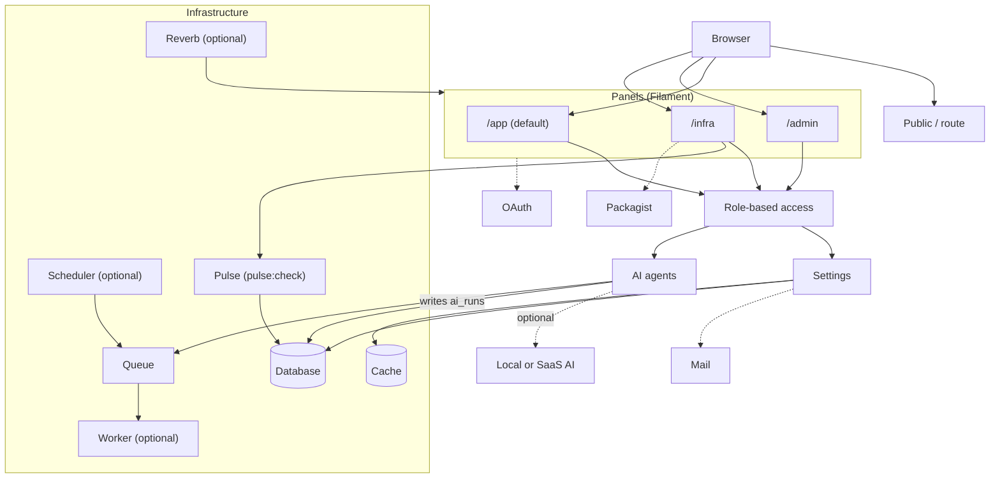
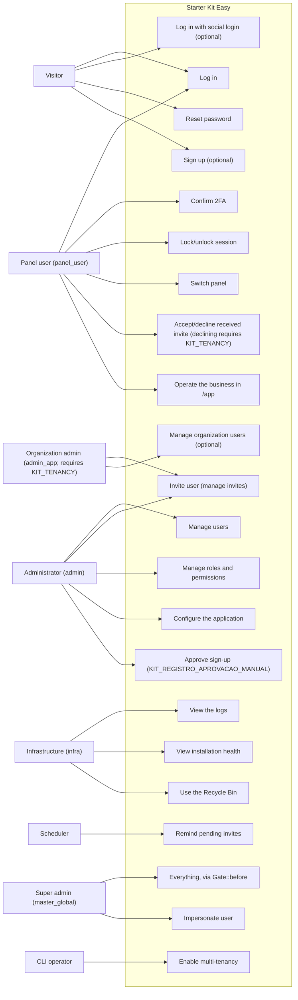
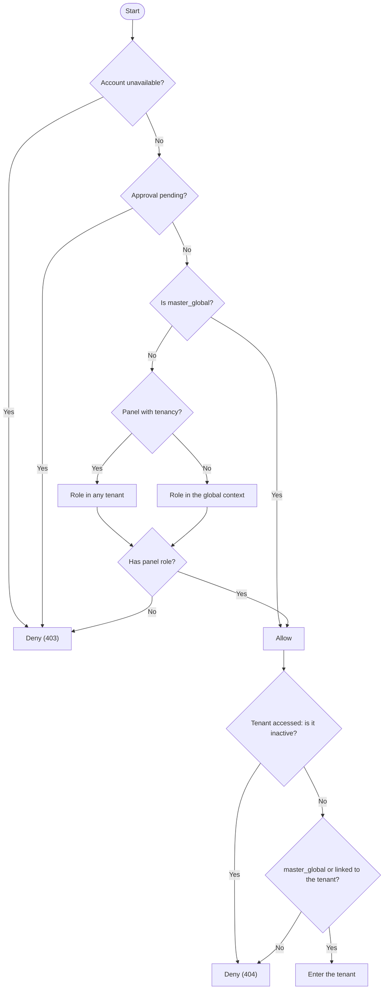
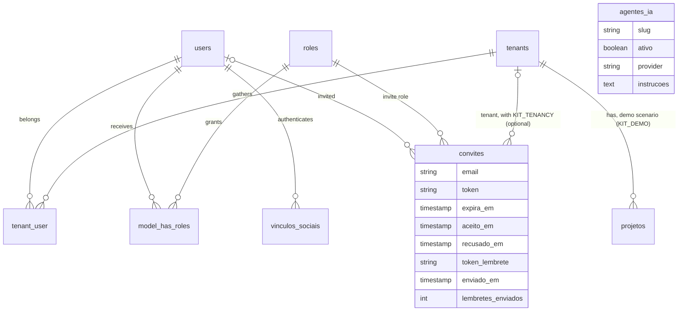

Twenty Mermaid diagrams show how the kit works today: architecture, role-based access, authentication, AI, infrastructure, the data model and the kit's own lifecycle. Each one is guarded by an automated test (`tests/Kit/DiagramasDaArquiteturaTest.php`, `tests/Kit/GuardasDosDiagramasTest.php` and, under multi-tenancy, `tests/Tenancy/DiagramasDaArquiteturaTenancyTest.php`) that fails the moment the code stops matching what the diagram describes — none of them describes planned functionality.

## DG-01 — Layered architecture

From the browser to the three Filament panels (`app/Providers/Filament/AppPanelProvider.php:id:79`, `app/Providers/Filament/AdminPanelProvider.php:id:69`, `app/Providers/Filament/InfraPanelProvider.php:id:90`), through role-based access, down to the database, queue, cache and the optional services. It is the same block as the README — a single source.

## DG-02 — Use cases by role

The kit's eight actors (visitor, `panel_user`, `admin_app`, `admin`, `infra`, `master_global`, the scheduler and the CLI) and the use cases each role reaches. `admin_app` only exists when `KIT_TENANCY` is on (`database/seeders/PapeisSeeder.php:papel:80`); the other roles are always seeded (`database/seeders/PapeisSeeder.php:papel:58`, `:papel:61`, `:papel:101`). Every edge ties the role to the permission entity it actually holds in the database (Shield) — or, for `master_global`, to the code that lets them through without Shield: `Gate::before` (`cu_tudo`) and, for "Impersonate user", `User::canImpersonate()` (`app/Models/User.php:canImpersonate:882`), which only accepts `master_global` — never to a guess.

## DG-03 — Panel access rule

The exact order of `User::canAccessPanel()` (`app/Models/User.php:canAccessPanel:157`): account unavailability (`:166`), pending approval (`:193`), `master_global` (`:206`), the role's context — any tenant with tenancy on, only the global context without it (`:217`) — and finally the panel role (`:219`). Once allowed, the `User::canAccessTenant()` extension (`:789`) decides the tenant, and the ORDER matters: an inactive organization denies first, for everyone — including `master_global` (`:813`) —; only then does `master_global` always get in (`:826`), and no link denies (`:830`).

## DG-13 — Core entity-relationship diagram

The central entities and how they reference each other: the account (`users`) to a tenant via `tenant_user` (`app/Models/User.php:tenants:778`, `app/Models/Tenant.php:users:118`), to a role via `model_has_roles` (Shield), the social link (`app/Models/User.php:vinculosSociais:788`), the invite — with a nullable `convidado_por_id` (`database/migrations/2026_08_13_000002_create_convites_table.php:convidado_por_id:42`) — via `papel()`, `tenant()` and `convidadoPor()` (`app/Models/Convite.php:papel:116`, `:tenant:122`, `:convidadoPor:128`) and the AI agent catalog — with no relation at all to `projetos`, the demo table (`app/Traits/BelongsToTenant.php:tenant:82`). `ai_runs` and `agent_conversations` are left out of this ER: they store identifiers as loose text (`subject_type`/`subject_id`, `participant_type`/`participant_id`), with no real foreign key, and drawing a relation for them would invent an FK the schema doesn't have. `passkeys` is left out for the opposite reason: the table exists (vendor), but no feature in the kit uses it — passkeys are disabled (`enablePasskeys()` is never called).

## About where these diagrams come from

[GitDiagram](https://gitdiagram.com/gsferro/filament-starter-kit-easy) generated a first, AI read of this repository — an AI-generated view, not verified. The official diagram is this page, which corrects and expands it: GitDiagram presented what is optional (organizations, tenancy) as always-present and left out the kit's central rule (role-based access).

## Index of the 20 diagrams

| DG | Diagram | Page |
|---|---|---|
| DG-01 | Layered architecture | This page |
| DG-02 | Use cases by role | This page |
| DG-03 | Panel access rule | This page |
| DG-04 | Password login and second factor | [Authentication](../../autenticacao/) |
| DG-05 | Unified login - destination by 0, 1 or N panels | [Unified login](../../autenticacao/login-unificado/) |
| DG-06 | Social login return | [Social login](../../autenticacao/login-social/) |
| DG-07 | Invitation, from send to acceptance | [Invites](../../autenticacao/convites/) |
| DG-08 | User account states | [User states](../../autenticacao/estados-de-usuario/) |
| DG-09 | Invitation states | [Invites](../../autenticacao/convites/) |
| DG-10 | Authenticated session | [Authentication](../../autenticacao/) |
| DG-11 | Assistant sequence | [Feature roadmap](../../operacao/roteiro-de-features/) |
| DG-12 | Map of /infra: screen, source and who writes it | [Infrastructure trails](../../recursos/trilhas-de-infraestrutura/) |
| DG-13 | Core entity-relationship diagram | This page |
| DG-14 | Where configuration comes from | [Kit settings](../../recursos/configuracoes-do-kit/) |
| DG-15 | Installation sequence | [Advanced installation](../../comecar/instalacao-avancada/) |
| DG-16 | The kit:update flow | [Updating the project](../../comecar/atualizando-o-projeto/) |
| DG-17 | The two delivery routes | [Updating the project](../../comecar/atualizando-o-projeto/) |
| DG-18 | Containers by Docker profile | [Advanced installation](../../comecar/instalacao-avancada/) |
| DG-19 | Background - composer dev x Docker Compose x scheduler | [Developing the kit](../../operacao/desenvolvendo-o-kit/) |
| DG-20 | Request to /app/{tenant} | [Multi-tenancy](../../recursos/multi-tenancy/) |
