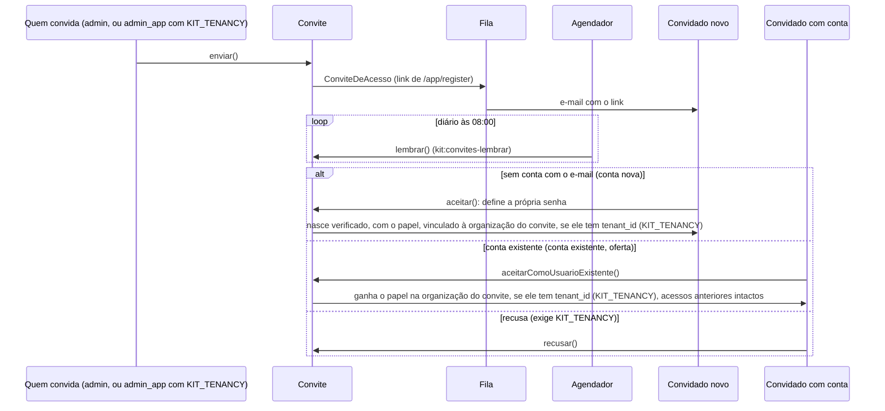

Alguém de fora vira usuário **por convite, e só por convite**. Um administrador abre
`/admin/convites` — ou, com tenancy, quem tem `admin_app` abre
`/app/{organizacao}/convites` — e escolhe e-mail, papel e organização; o kit envia um link
com token de uso único.

**Quem convida não precisa saber se o endereço já tem conta.** O kit decide no aceite, e as
duas vias usam o mesmo convite e o mesmo link:

| O endereço | O que acontece no aceite |
|---|---|
| **não tem** conta | a pessoa define a própria senha e nasce com o papel certo, no contexto certo, e com o e-mail já verificado — o token prova a posse do endereço |
| **já tem** conta | é uma **oferta de acesso**: ninguém é cadastrado de novo. A pessoa entra com a senha que já tem, confirma, e é vinculada à organização com o papel do convite — os acessos dela nas outras organizações ficam intactos |

Na via de oferta o token **não basta**: o aceite exige que a conta autenticada seja a do
e-mail convidado, conferido no model e não na query da tela. Link interceptado não vira
acesso sem a senha do endereço convidado.

E dá para dizer **não**. O menu do usuário ganha **Convites recebidos**, com a contagem das
ofertas pendentes e as ações de aceitar e recusar; a recusa fica **registrada**, o convite
deixa de valer (inclusive pelo link) e quem administra vê "Recusado" na listagem em vez de
reconvidar alguém que já disse não. O link do e-mail continua sendo a via canônica: ele
funciona também para quem ainda não pertence a nenhuma organização e por isso não alcança
essa tela.

A tela de aceite é a página de registro nativa do Filament (`/app/register`), com uma
guarda: **sem token válido na query string ela recusa e manda para o login**. Não existe
cadastro aberto.

| O que | Como |
|---|---|
| Token | `Str::random(64)`, guardado **hasheado** (`sha256`) — banco vazado não vira acesso |
| Validade | `KIT_CONVITE_VALIDADE_DIAS` (7 dias por padrão) |
| Em massa | **Convidar em massa** no header da listagem: cole os endereços, um papel e uma organização para o lote. Até `KIT_CONVITE_LIMITE_LOTE` (100 por padrão) — um endereço com problema **não impede os outros**, e o resumo diz quantos saíram e por que os outros não |
| Uso | **único**: na conta nova, `aceito_em` é carimbado na mesma transação que cria o usuário; na oferta, por `update` condicional — é o que impede dois cliques de valerem duas vezes |
| Lembrete | `KIT_CONVITE_LEMBRETES_DIAS` (D+3 e D+5 por padrão, contados do envio): o kit manda **um** lembrete por convite por dia devido, com um **segundo link paralelo** — o link original **continua valendo**, e nada é revogado nem se o lembrete cair no spam. O teto é a quantidade de dias da lista, e a lista vazia desliga a feature. Todo dia precisa ser **menor** que a validade, senão o convite expira antes de o lembrete ser devido e nenhum lembrete sai |
| Reenviar | gera token novo e **mata os links anteriores** — o do envio e o do último lembrete |
| Revogar | apaga o convite; o link para de funcionar na hora, e a exclusão fica em `/infra/audits` |
| Editar | **não existe** — o convite já foi enviado; corrija revogando e criando outro |

> ⚠️ **O convite depende de duas coisas de ambiente.** `MAIL_MAILER` no default `log` só
> escreve o e-mail em `storage/logs` — nada sai para o mundo. E a notificação é
> enfileirável com `QUEUE_CONNECTION=database`: **sem um worker rodando o convite não
> sai**. O `composer dev` sobe um; num deploy, `php artisan queue:work`. A fila parada
> aparece no monitor do `/infra`. **Multiplique por N no convite em massa**: um lote de cem
> põe cem linhas em `jobs` e entrega zero, e a tela diz "cem enviados" — porque foram, para
> a fila. Com `QUEUE_CONNECTION=sync` é o oposto: cada e-mail é um handshake SMTP dentro do
> request, e cem encostam no `max_execution_time`. É o que o limite do lote protege.

> ⚠️ **O lembrete exige as duas coisas acima E o scheduler.** Quem manda é
> `kit:convites-lembrar`, agendado em `routes/console.php` para as 08:00 — sem
> `php artisan schedule:work` (ou o serviço `scheduler` do docker compose) ele nunca é
> chamado. E o contador do convite **sobe mesmo com o worker parado**: a gravação acontece
> antes de a notificação ser enfileirada, de propósito, para que um endereço permanentemente
> quebrado não faça o cron tentar o mesmo convite todo dia para sempre. A consequência é
> honesta: worker parado gasta lembretes sem entregar e-mail. Numa instalação com convites
> antigos acumulados, ensaie com `MAIL_MAILER=log` — que é o default do kit.

O papel do convite decide o contexto da atribuição: papel do painel `/app` nasce dentro da
organização do convite; papel de `/admin` ou `/infra` nasce no contexto global — ser
administrador de uma organização não é credencial para administrar a instalação.

## Sequência: do envio ao aceite

O link sai sempre pela rota de registro do painel `/app`, qualquer que seja o papel do convite
(`app/Notifications/ConviteDeAcesso.php:url:100`); a notificação é `ShouldQueue` — sem
worker, nada sai (`app/Notifications/ConviteDeAcesso.php:ShouldQueue:27`). O lembrete só existe pelo
comando agendado (`routes/console.php:40`,
`app/Console/Commands/KitConvitesLembrar.php`), o único chamador de `lembrar()` em `app/`.
`Convite::enviar()`, `::lembrar()`, `::aceitar()`, `::aceitarComoUsuarioExistente()` e `::recusar()`
(`app/Models/Convite.php:enviar:143`, `:lembrar:207`, `:aceitar:606`,
`:aceitarComoUsuarioExistente:674`, `:recusar:739`).

## Estados do convite

```mermaid
stateDiagram-v2
%% DG-09
accTitle: Estados do convite
accDescr: Do Pendente, o convite vai a Aceito, Recusado (só com KIT_TENANCY) ou Expirado; só o Expirado volta a Pendente por reenvio; revogar apaga o convite de qualquer estado.
  Pendente --> Aceito : aceitar
  Pendente --> Recusado : recusar
  Pendente --> Expirado : prazo vence
  Expirado --> Pendente : reenviar
  Pendente --> [*] : revogar
  Aceito --> [*] : revogar
  Recusado --> [*] : revogar
  Expirado --> [*] : revogar
  note right of Recusado: recusar exige KIT_TENANCY (caixa de convites recebidos)
```

`Convite::situacao()` tem a precedência Aceito &gt; Recusado &gt; Expirado &gt; Pendente
(`app/Models/Convite.php:situacao:587`, `:'Aceito':590`, `:'Recusado':591`); a ação Reenviar só é
visível em Pendente ou Expirado
(`app/Filament/Admin/Resources/Convites/Tables/ConvitesTable.php:Action::make('reenviar'):73`,
`:situacao() === 'Pendente':89`); a revogação é o `DeleteAction` nativo, visível em todo estado
(`app/Filament/Admin/Resources/Convites/Tables/ConvitesTable.php:DeleteAction::make():97`). O
evento recusar só existe pela caixa de convites recebidos, que só existe com a tenancy
(`app/Filament/App/Pages/ConvitesRecebidos.php:Action::make('recusar'):132`,
`:config('kit.tenancy.enabled'):77`).

