A conta de cada usuário tem **três estados** e eles vencem o acesso a qualquer painel:

- **Ativo**: entra com senha ou login social normalmente.
- **Inativo**: a senha ou o login social reconhece a conta, mas a pessoa cai num aviso dizendo que ela foi **desativada** e pedindo para entrar em **contato com o administrador** para **Reativar**; a sessão não abre.
- **Excluído**: a exclusão é lógica; quem tentar entrar cai num aviso com a data de exclusão e, a depender do papel, pode **Restaurar** pela lista de usuários no `/admin` ou pela **Lixeira** no `/infra`.

Quem tem a permissão `Desativar:User` vê a ação de desativar na lista do `/admin` e a permissão `Reativar:User` vê a ação correspondente. A própria pessoa não consegue desativar a própria conta, e o sistema recusa desativar o último `master_global` ativo. A proteção vale no login por **senha**, no login social e na confirmação por link.

Conta indisponível também **não pode ser personificada**: a ação *Personificar* não aparece na linha de quem está inativo, pendente de aprovação ou excluído. É a mesma régua do acesso aos painéis — se a pessoa não consegue entrar sozinha, ninguém entra por ela.

## Estados da conta

```mermaid
stateDiagram-v2
%% DG-08
accTitle: Estados da conta do usuário
accDescr: Pendente (só existe com KIT_REGISTRO e KIT_REGISTRO_APROVACAO_MANUAL) aprova para Ativo (ou Inativo, se foi desativada antes); Ativo e Inativo alternam por desativar/reativar; qualquer um deles pode ser excluído, e restaurar volta ao estado de antes da exclusão.
  Pendente --> Ativo : aprovar [estava ativa]
  Pendente --> Inativo : aprovar [estava desativada]
  Ativo --> Inativo : desativar [não é a própria conta / não é o último master_global ativo]
  Ativo --> Excluida : excluir
  Inativo --> Ativo : reativar
  Inativo --> Excluida : excluir
  Pendente --> Excluida : excluir
  Excluida --> Ativo : restaurar [estava ativa]
  Excluida --> Inativo : restaurar [estava inativa]
  Excluida --> Pendente : restaurar [estava pendente]
  state "Excluída" as Excluida
  note right of Pendente : só existe com KIT_REGISTRO e KIT_REGISTRO_APROVACAO_MANUAL
```

O rótulo "Pendente" esconde o `ativo`: uma conta pendente pode ser desativada sem deixar de ser
Pendente, e só ao ser aprovada revela se estava ativa (vai a Ativo) ou desativada (vai a Inativo) —
por isso a condição na seta de `aprovar`. `rotuloDaSituacao()` devolve Pendente antes de Inativo
antes de Ativo (`app/Models/User.php:rotuloDaSituacao:501`, `:'Pendente':504`); `aprovar()` só baixa
a pendência, sem tocar `ativo` (`app/Models/User.php:aprovar:520`, `:526`); `desativar()` recusa a
própria conta e o último `master_global` ativo (`app/Models/User.php:desativar:285`,
`:propria_conta:349`, `:ultimo_master_global:350`); a exclusão é lógica (`SoftDeletes`) e vence a
exibição de Pendente/Ativo/Inativo (`app/Models/User.php:SoftDeletes:85`); `restore()` (nativo do
`SoftDeletes`, disparado pela `RestoreAction` do `/admin`) devolve o estado gravado antes da
exclusão.

