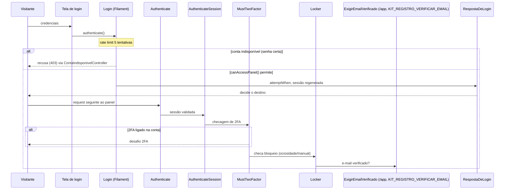
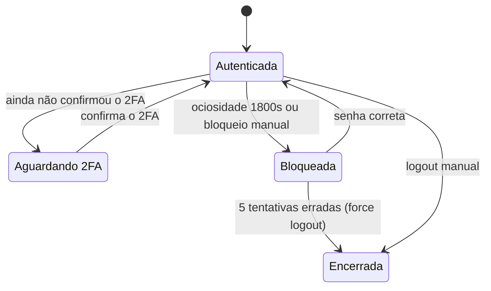

Como alguém entra — e como alguém deixa de entrar: convite, registro aberto com aprovação, login
social nos quatro provedores, a página única de login opcional (`/login`), proteção anti-robô, os
três estados da conta e o que a rota pública `/` mostra (e o que ela deliberadamente não mostra).

A ordem exata das checagens de acesso a um painel — indisponibilidade, aprovação pendente,
`master_global`, papel — está no diagrama [Regra de acesso ao painel](../referencia/arquitetura-em-diagramas/)
(DG-03), na página de arquitetura em diagramas.

## Sequência: login por senha e 2FA

A tela de login do kit intercepta a falha do Filament só para explicar a conta indisponível
(`app/Filament/Pages/Auth/TelaLogin.php:authenticate:196`); o rate limit de 5 tentativas é do
próprio Filament (`vendor/filament/filament/src/Auth/Pages/Login.php:rateLimit(5):70`), que também
decide com `canAccessPanel()` (`vendor/filament/filament/src/Auth/Pages/Login.php:canAccessPanel:172`).
O destino do login é sempre `app(LoginResponse::class)`, vinculado a `RespostaDeLogin`
(`app/Providers/KitServiceProvider.php:LoginResponse:863`). A pilha do próximo request (ordem real,
conferida com `php artisan route:list --json`) é `Authenticate` → `AuthenticateSession` →
`MustTwoFactor` → `Locker` → `ExigirEmailVerificado` (só obrigatório no `/app`, com a chave ligada).

## Sessão autenticada

O desafio de 2FA só existe para quem o confirmou antes — é o `MustTwoFactor` do próprio diagrama de
cima. O bloqueio por ociosidade usa `config('lockscreen.idle_timeout')` = 1800
(`config/lockscreen.php:idle_timeout:16`); os três painéis compartilham o mesmo limite de
tentativas com força de logout (`app/Providers/Filament/AdminPanelProvider.php:enableRateLimit:267`,
`app/Providers/Filament/AppPanelProvider.php:enableRateLimit:381`,
`app/Providers/Filament/InfraPanelProvider.php:enableRateLimit:290`).
