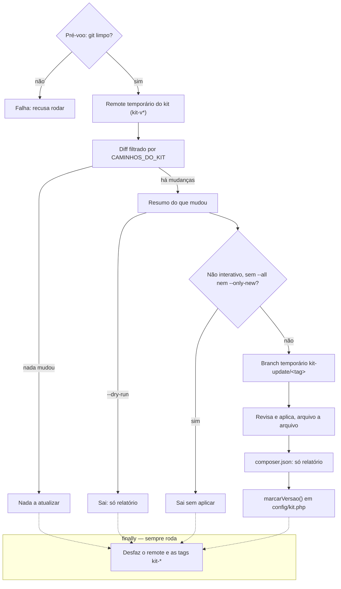
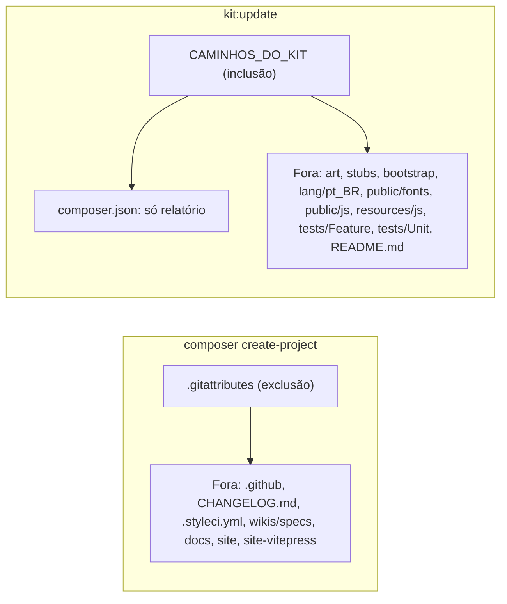

**O kit é um ponto de partida, não uma dependência.** Depois do `create-project` o projeto é seu: você renomeia painéis, muda `canAccessPanel()`, edita seeders. Por isso **não existe** um `kit:update` que sobrescreve arquivos — ele reescreveria justamente o que você personalizou, e um starter kit que estraga o projeto do usuário não serve para nada.

O que muda separa-se em três camadas, e cada uma tem um caminho próprio:

| Camada | O que é | Como atualizar |
|---|---|---|
| **Dependências** | Filament, plugins, Laravel | `composer update` — é a maior parte das melhorias e chega sozinha |
| **Cola do kit** | providers, traits, widgets, views de erro | diff manual contra a tag nova (abaixo) |
| **Seu negócio** | tudo que você escreveu | nunca é tocado |

## O jeito fácil: `php artisan kit:update`

O comando automatiza a etapa do git inteira e **não aplica nada sem sua aprovação**:

```bash
php artisan kit:update --dry-run   # só mostra o que mudou
php artisan kit:update             # revisa e aplica, arquivo a arquivo
```

O que ele faz, em ordem:

1. **Confere o terreno** — exige repositório git com a árvore limpa. Sem isso não haveria como reverter, e ele recusa rodar (mostrando os comandos para versionar o projeto).
2. **Vincula o kit temporariamente** — adiciona o remote `kit` com **push bloqueado** e busca as tags num namespace próprio (`kit-v*`), para não colidirem com as versões do seu projeto.
3. **Compara** — da versão em `config('kit.version')` até a tag escolhida, restrito aos caminhos que pertencem ao kit. Seu código de negócio nunca entra na conta.
4. **Oferece um branch temporário** (`kit-update/v0.16.0`) para não sujar o seu.
5. **Pergunta arquivo a arquivo** — ver o diff, aplicar, pular ou parar. Dá para mudar de ideia no meio e aplicar o resto em lote. Arquivo removido do kit nunca é apagado automaticamente: ele só avisa.
6. **Desfaz o vínculo** — remove o remote e as tags `kit-*` ao sair, mesmo se você interromper no meio. O projeto não fica com nada de terceiros pendurado.

7. **Marca a versão aplicada** em `config/kit.php` — só aquela linha, sem tocar no resto do arquivo. É o ponto de partida da próxima comparação.

O fluxo é **não interativo** quando não há terminal (CI, `--no-interaction`) — nunca "sem TTY": ele
vira relatório e sai sem aplicar nada, a menos que `--all` ou `--only-new` já tenham dado a
aprovação na linha de comando (`app/Console/Commands/KitUpdate.php:isInteractive:427`).



A ordem vem direto de `KitUpdate::handle()`
(`app/Console/Commands/KitUpdate.php:handle:375`): pré-voo (`:preVoo:463`), remote temporário
(`:vincularKit:523`), diff restrito (`:arquivosAlterados:629`), resumo (`:mostrarResumo:748`), a
checagem de terminal (`:isInteractive:427`), o branch temporário (`:prepararBranch:768`), a revisão
por arquivo (`:revisarEAplicar:817`), o relatório do `composer.json`
(`:relatarComposerJson:1001`, `:CAMINHOS_SO_RELATORIO:365`) e `marcarVersao()`
(`:marcarVersao:1049`, chamada dentro de `:encerrar:1035`). O `finally` que desfaz o remote roda em
todo caminho de saída, inclusive erro (`:desvincularKit:532`).

Dois detalhes que aparecem na prática:

- **`config/kit.php` sempre consta como "modificado"** (ele carrega a marca de versão). Aplicá-lo traz as chaves novas do kit, mas **substitui o arquivo inteiro** — se você mudou credenciais do seeder ou adicionou chaves próprias ali, veja o diff e copie só o que interessa em vez de aplicar.
- **O próprio `kit:update` se atualiza.** Como o PHP já carregou a classe em memória, o comportamento novo (e as mensagens novas) só valem a partir da execução seguinte. O comando avisa quando isso acontece. A **lista de caminhos** que filtra o diff é lida da **versão destino** (a partir da v0.30.1), então diretório que só a versão nova cobre chega na mesma rodada — o aviso "rode o comando de novo" só aparece quando essa leitura falhou. **Instalação anterior à v0.30.1** ainda roda a lista antiga na primeira rodada: rode a segunda com o comando que o aviso imprime. O caso conhecido é v0.22.x → v0.23.0 ou posterior, que deixava `View [svg.arte-do-login] not found` entre as duas rodadas; a segunda rodada resolve, ou copie `resources/views/svg/arte-do-login.blade.php` do repositório do kit.

### Dependência nova do kit: o `composer.json` nunca é aplicado

O `kit:update` **não sobrescreve o seu `composer.json`** — ele carrega as dependências do SEU
projeto, e aplicá-lo apagaria tudo que você instalou depois do kit. Em vez disso, o comando
**relata** o que mudou ali (pacote novo, script novo) e você copia à mão:

```bash
git diff kit-v0.35.0 kit-v0.36.0 -- composer.json
composer update
php artisan filament:assets   # obrigatório quando o pacote novo publica CSS/JS
```

> **O relatório só aparece quando o comando sabe de onde você partiu.** Ele lê
> `config('kit.version')`; se essa marca não casar com uma tag do kit, passe `--from=vX.Y.Z`.

**Na v0.36.0 isso vale para `mortalkiller/filament-page-header`**, que traz o cabeçalho rico das
telas de registro e publica CSS e JS próprios. Sem o `composer require` + `filament:assets`, as
telas de View/Edit de usuário e organização respondem normalmente, só que sem o cabeçalho.

### Tela nova: ressemeie os dois seeders

Os "próximos passos" que o comando imprime citam `filament:assets` e os testes, **não os seeders** —
e tela nova do kit costuma trazer permissão nova, que nasce sem dono no seu banco:

```bash
php artisan db:seed --class=Database\Seeders\ShieldPermissionsSeeder
php artisan db:seed --class=Database\Seeders\PapeisSeeder
```

Os dois são idempotentes — rodar de novo não duplica nada.

**Na v0.36.0, especificamente, eles são no-op** — e vale saber por quê, para não procurar defeito
onde não há. A tela `ViewUser` que essa versão traz consome a permissão `View:User`, e essa
permissão **já era gerada e distribuía desde sempre**: `view` está em
`config('filament-shield.policies.methods')`, então o `ShieldPermissionsSeeder` sempre a criou e o
`PapeisSeeder` sempre a entregou aos papéis. Entre a v0.35.0 e a v0.36.0 nem os seeders nem o
`config/filament-shield.php` mudaram uma linha (`git diff v0.35.0 v0.36.0 -- database/seeders
config/filament-shield.php` volta vazio). O que faltava era a **tela**, não a permissão: o
checkbox em `/admin/shield/roles` existia e não decidia nada.

Rode os dois assim mesmo. O hábito custa dois comandos idempotentes e paga na versão que trouxer
um Resource ou uma Page de fato novos — aí a permissão nasce mesmo sem dono no seu banco, e o
sintoma é uma tela que ninguém enxerga.

Ao final nada está commitado: você revisa com `git diff`, roda `php artisan migrate` se chegou migration nova (a partir da v0.31.0 o comando entrega também `database/settings/`, e a tela de configurações quebra enquanto a propriedade nova não tiver linha no banco), roda `composer test:kit` (a fundação) e commita. Deu errado? `git checkout -- .` desfaz, ou apague o branch e volte para o seu.

- **A URL da tela de configurações mudou na v0.32.0.** Ela passou a responder em
  `/admin/configuracoes-da-aplicacao`, o nome que já exibia no menu. O slug antigo responde **301**
  para o novo, então favorito e link antigo continuam chegando. Se o seu projeto escreveu o
  endereço antigo à mão em algum lugar — um teste, um link numa view sua, um bookmarklet —,
  atualize; a permissão (`View:ConfiguracoesDoKit`) e a classe não mudaram, só o slug.
**Não precisa aprovar 30 arquivos um a um.** Durante a revisão, o menu oferece *"Aplicar todos os arquivos NOVOS daqui em diante"* e *"Aplicar TUDO daqui em diante"* — uma confirmação vale para o conjunto. E dá para começar já em lote:

```bash
php artisan kit:update --only-new   # só o que ainda não existe no projeto
php artisan kit:update --all        # tudo, inclusive o que sobrescreve
```

A distinção é o ponto: **arquivo novo não tem o que sobrescrever**, então aplicá-los em massa é seguro — é o caso dos widgets, do Spotlight, das concerns, do CSS do kit (`resources/css/filament/` e `public/css/kit/`, entregues a partir da v0.30.0) e das migrations de Settings (`database/settings/`, a partir da v0.31.0). O **`.env.example`** também passou a ser entregue (a partir da v0.32.2): ele é arquivo de sugestão, é onde o kit documenta cada chave nova, e o seu `.env` continua intocado — mas ele entra como **modificado**, então revise o diff se você acrescentou chaves próprias ali. Já um **modificado** substitui o conteúdo atual, e se você editou aquele arquivo a sua versão se perde (recuperável com `git checkout -- <arquivo>`, já que nada é commitado). Por isso `--only-new` é o lote recomendado para a primeira passada, deixando os modificados para revisar com calma.

| Opção | Para quê |
|---|---|
| `--only-new` | aplica de uma vez só os arquivos novos (não sobrescreve nada) |
| `--all` | aplica tudo de uma vez, com uma confirmação para o conjunto |
| `--dry-run` | só o relatório, não altera nada |
| `--tag=v0.16.0` | comparar com uma versão específica |
| `--from=v0.15.0` | dizer de qual versão o projeto partiu (quando `config/kit.php` não sabe) |
| `--branch=nome` | escolher o nome do branch temporário |
| `--no-branch` | aplicar no branch atual |
| `--keep-remote` | manter o remote e as tags do kit ao final |
| `--repo=URL` | comparar com outro repositório do kit (um fork, por exemplo); o padrão é `config('kit.repository')`, que lê `KIT_REPOSITORY` do `.env` |

Sem terminal (CI, `--no-interaction`) o comando vira relatório e não altera nada — a menos que você passe `--only-new` ou `--all`, que **são** a aprovação, dada na linha de comando.

## As duas rotas de entrega

O kit chega ao seu projeto de dois jeitos, e cada um entrega um recorte diferente da árvore. O
`composer create-project` traz **tudo que o `.gitattributes` não exclui**
(`.gitattributes:/docs export-ignore:40`, `.gitattributes:/site export-ignore:46`,
`.gitattributes:/wikis/specs export-ignore:32`, `.gitattributes:/.github export-ignore:20`); o
`kit:update` traz **só os caminhos de `CAMINHOS_DO_KIT`**
(`app/Console/Commands/KitUpdate.php:CAMINHOS_DO_KIT:93`), com o `composer.json` como exceção — ele
viaja no `create-project`, mas no `kit:update` é **só relatório**, nunca aplicado (a seção acima,
"Dependência nova do kit").



Um diretório listado **em parte** não é desenhado como entregue inteiro: `app/Models` no
`kit:update` é só os 7 arquivos do kit, um a um
(`app/Console/Commands/KitUpdate.php:'app/Models/User.php':118`), nunca o model que você acrescentar
depois — e `config/` é só cinco arquivos nomeados
(`app/Console/Commands/KitUpdate.php:'config/kit.php':153`). E `wikis/` **não** é `export-ignore`
inteiro — só `wikis/specs`: os documentos de topo de `wikis/` viajam no `create-project` **e** o
`kit:update` os entrega um a um (`app/Console/Commands/KitUpdate.php:'wikis/README.md':309`),
assim como `tests/Kit` e `tests/Pest.php`
(`app/Console/Commands/KitUpdate.php:'tests/Kit':233`, `app/Console/Commands/KitUpdate.php:'tests/Pest.php':252`)
— `tests/` não é "intocado pelo kit:update".

## O jeito manual

Se preferir controlar cada passo — ou entender o que o comando faz por baixo:

Adicione o kit como um **segundo remote**, uma única vez. Seu `origin` continua sendo o seu projeto; o `kit` é só uma fonte de leitura:

```bash
git remote add kit https://github.com/gsferro/filament-starter-kit-easy.git

# o remote do kit é somente-leitura: evita um `git push kit main` acidental
# mandar o SEU projeto para dentro do repositório do kit
git remote set-url --push kit no_push
```

As tags do kit vão para um namespace próprio (`kit-v*`). Isso importa: um `git fetch kit --tags` traria `v0.15.0`, `v0.16.0`… para o seu projeto e colidiria com as **suas** versões depois.

```bash
git fetch --no-tags kit 'refs/tags/*:refs/tags/kit-*'
git tag -l 'kit-*'      # kit-v0.15.0, kit-v0.16.0, ...
```

Depois, a cada versão, veja o que mudou e traga só o que interessa:

```bash
# 1. panorama entre a sua versão e a nova
git diff kit-v0.15.0..kit-v0.16.0 --stat

# 2. o diff da "cola" do kit (ignore o que você já reescreveu)
git diff kit-v0.15.0..kit-v0.16.0 -- app/Providers app/Filament/Concerns \
        app/Filament/Spotlight app/Traits resources/views/errors config/kit.php

# 3. traga arquivo a arquivo, revisando
git checkout kit-v0.16.0 -- resources/views/errors
git checkout kit-v0.16.0 -- app/Filament/Concerns/BadgeContagemNavegacao.php
```

Faça isso num branch (`git switch -c atualiza-kit`) e rode `composer test` antes do merge. Arquivos que você reescreveu: leia o diff e aplique à mão — é o único caminho seguro.

> 💡 **TODO / rumo do projeto:** extrair a "cola" para um pacote Composer próprio (`gsferro/kit-core`) com os providers, traits, widgets e páginas de infra. Aí a camada do meio vira `composer update gsferro/kit-core` e o skeleton fica mínimo — só o que é mesmo ponto de partida. É a evolução natural deste kit.

