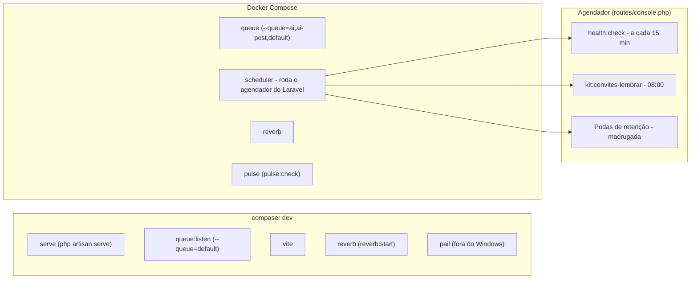

Esta seção é para quem **mexe no kit**, não para quem o instalou. Nada aqui é necessário num
projeto que nasceu do `create-project`.

## Ferramentas privadas ficam FORA do pacote publicado

O `filament/blueprint` é pago e vive num repositório privado. Ele ajuda a evoluir o kit, e por
isso **nunca** entra no estado commitado. O motivo é mais duro que "boa prática":

`composer create-project` instala as dependências de **dev** por default — o próprio `--help`
diz *"Enables installation of require-dev packages (enabled by default)"* — e faz isso **antes**
de rodar o `post-create-project-cmd`. Com o Blueprint no `composer.json` ou no `composer.lock`
publicados, quem não tem licença leva **403** durante a resolução das dependências, e o kit fica
**não-instalável**. O gancho que limparia nunca chega a rodar.

Por isso o Blueprint não é "removido na instalação", ao contrário do vínculo com o Snyk (que é
arquivo inerte e sai no gancho). Ele entra e sai por script, e o estado commitado é sempre
"desligado":

```bash
composer bp:on    # declara o repositório e faz o require --dev
composer bp:off   # remove o pacote e o repositório
```

A credencial vai no `auth.json` **global**, que não existe dentro do projeto:

```bash
composer config --global --auth http-basic.packages.filamentphp.com "<seu-email>" "<seu-token>"
```

O token vem da sua conta do Filament. O `/auth.json` local está no `.gitignore` como última
linha de defesa, mas o global é melhor: o arquivo nem existe ali para alguém commitar com
`git add -f`.

`tests/Kit/BlueprintForaDoPacoteTest.php` guarda isso. **Com o Blueprint ligado, esses casos
ficam vermelhos** — de propósito: é o lembrete de rodar `composer bp:off` antes de commitar.


## Como o site de documentação é publicado

Este site — <https://gsferro.github.io/filament-starter-kit-easy/> — é o conteúdo de `docs/`
construído pelo **Astro Starlight** e publicado por **GitHub Actions**. O ciclo de atualização
inteiro é:

1. editar o markdown em `docs/pt/` e `docs/en/` — **sempre nos dois idiomas**, no mesmo commit;
2. commitar e fazer push para a branch padrão (`main`);
3. o fluxo `.github/workflows/pages.yml` constrói e publica sozinho, em cerca de dois minutos.

**Para ver antes de publicar**, rode a prévia local:

```bash
cd site
npm install
npm run dev      # http://localhost:4321
```

**O conteúdo fica em `docs/`, não dentro do projeto Astro.** O layout convencional do Starlight é
`src/content/docs/`, e o kit não o usa de propósito: nove arquivos do repositório apontam para
`docs/`, entre eles o helper `documentacaoDoKit()` que quatro testes de outras features consomem.
O Astro vai até o conteúdo por um loader `glob` com `base: '../docs'`, e não o contrário — a
decisão está na ADR-02 da wiki `site-starlight`.

Duas consequências práticas disso, e as duas já custaram tempo:

- **a barra lateral é declarada, não descoberta.** O `autogenerate` do Starlight não funciona com
  o conteúdo fora da raiz do projeto Astro: os grupos renderizam vazios. A lista vive em
  `site/sidebar.json`, gerada pelo `site/converter.mjs`. Página nova que não entre nela fica
  invisível na navegação — o `[CT-20]` reprova quando isso acontece;
- **componentes MDX não funcionam nas páginas.** Um `import` de `@astrojs/starlight/components`
  dentro de `docs/` não resolve o `node_modules` de `site/`. As landings usam `hero` no
  front-matter e HTML simples.

**A tradução casa por CAMINHO IDÊNTICO.** É o contrato do i18n do Starlight: `pt/recursos/x.md`
e `en/recursos/x.md` são a mesma página em dois idiomas. Renomear o slug de um lado só faz o
Starlight servir a página portuguesa sob `/en/` como fallback, em silêncio — é por isso que as
páginas em inglês têm slug em português, e o `[CT-20]` confere o espelho.

**As URLs antigas continuam funcionando.** O Jekyll publicava `x.html` e o Starlight publica `x/`;
os 54 redirecionamentos vivem em `site/public/**` e são **commitados**, não gerados no build —
depois que o Jekyll saiu, não há mais de onde derivá-los.

A única parte que **não** está em arquivo nenhum é a origem do site, que é configuração do
repositório: **Settings → Pages → Build and deployment → Source: GitHub Actions**. É o único passo
que um `git revert` não desfaz e que nenhum teste alcança — se o site sumir com todos os arquivos
no lugar, é ali que se olha.

`docs/` e `site/` são `export-ignore`: o site é material do kit e não chega ao projeto que nasce do
`create-project`. As guardas disso ficam em `tests/Kit/SiteDeDocumentacaoTest.php`.

## O que roda em segundo plano

`composer dev` sobe **servidor + fila + vite + reverb** juntos, num só terminal
(`composer.json:"dev":123`, que roda `php artisan dev`); quem registra cada processo é o
próprio Laravel, em `DevCommands::registerDefaults()`
(`vendor/laravel/framework/src/Illuminate/Foundation/DevCommands.php:registerDefaults:106`).
O `serve` sobe o servidor de desenvolvimento (`:serve:112`).
O `queue:listen --tries=1 --timeout=0` roda sem `--queue`, e por isso só escuta a fila `default`
(`:queue:listen:113`, `vendor/laravel/framework/src/Illuminate/Queue/Console/ListenCommand.php:getQueue:85`,
`config/queue.php:'queue':42`).
O `vite` entra quando há `package.json` (`:node('dev', 'vite'):120`).
Só fora do Windows entra também o `pail` (`:pcntl_fork:115`).
O `reverb:start` entra pelo próprio pacote do Reverb
(`vendor/laravel/reverb/src/Reverb.php:reverb:start:15`).



O agendador **não** roda dentro do `composer dev` — é a correção que
`routes/console.php:composer dev:19-21` já registra por escrito: rode `php artisan schedule:work`
à parte, ou ligue o serviço `scheduler` do Docker Compose. Ele é quem de fato executa os eventos de
`routes/console.php` (`:'health:check':29`, `:'kit:convites-lembrar':40`, mais as podas de
retenção às 02h). O container `queue` do Compose escuta um superconjunto do que o `composer dev`
escuta (`docker-compose.yml:queue:274`, contra `default` do `composer dev`); `reverb` e `pulse` do
Compose repetem os mesmos comandos do `composer dev` e do `pulse:check`, só que containerizados
(`docker-compose.yml:reverb:337`, `docker-compose.yml:pulse:367`).
