O painel de infraestrutura já mostrava **saúde** (Health), **desempenho** (Pulse), **arquivo de
log** (Logs Explorer) e **filas** (Jobs Monitor) — e nenhum deles respondia "qual exception está
estourando, e quantas vezes", "o convite chegou?" ou "dá para desfazer aquele delete?". Três telas
respondem cada uma dessas perguntas:

| Tela | Onde | O que responde |
|---|---|---|
| **Exceções** | `/infra`, grupo *Observabilidade* | as exceptions agrupadas por tipo e frequência, com badge de contagem no menu |
| **Trilha de e-mails** | `/infra`, grupo *Trilhas* | todo e-mail que o kit enviou — separa "não foi enviado" de "foi enviado e caiu no spam" |
| **Lixeira** | `/infra`, grupo *Sistema* | restaura registro apagado com `SoftDeletes` |

## Mapa do /infra: tela, fonte e quem grava

Toda tela do painel `/infra` — as próprias Resources e as páginas cuja fonte é gravada por outro
processo — liga a uma tabela ou canal real, nunca a um gravador inventado. O backup **não** está
ligado a um agendamento ativo: `Schedule::command('backup:run')` continua comentado em
`routes/console.php:backup:run:141`, e só roda a mão, pelo Command Center; o health não é o único
agendado — o `health:check` roda a cada 15 minutos (`routes/console.php:health:check:29`), e o
mesmo agendador ainda expurga a trilha de autenticação (`routes/console.php:'authentication-log:purge':32`),
poda as exceções (`routes/console.php:'model:prune':64`), limpa e-mails, importações e exportações
antigas (`routes/console.php:'kit:limpar-trilha-de-emails':93`) e lembra convites pendentes
(`routes/console.php:'kit:convites-lembrar':40`).

```mermaid
flowchart TD
%% DG-12
accTitle: Mapa do /infra: tela, fonte e quem grava
accDescr: Cada tela do painel /infra liga-se à tabela ou fonte que mostra e a quem grava nela; o backup está desligado por padrão, e o health é agendado a cada 15 minutos.
  subgraph telas ["Telas do /infra"]
    tela_health["Health"]
    tela_backups["Backups"]
    tela_jobs["Jobs (filas)"]
    tela_logs["Logs"]
    tela_excecoes["Exceções agrupadas"]
    tela_email["Trilha de e-mails"]
    tela_lixeira["Lixeira"]
    tela_auditoria["Auditoria"]
    tela_log_acesso["Log de autenticação"]
    tela_comandos["Central de comandos"]
    tela_comandos_cadastro["Central de comandos: comandos cadastrados"]
    tela_pacotes["Releases de pacotes Composer"]
    tela_pulse["Pulse"]
    tela_ia["Execuções de IA"]
  end
  tela_health -->|"health:check, a cada 15 min"| health_store[("health_check_result_history_items")]
  tela_backups -.->|"backup:run, desligado por padrão"| backup_runs[("backup_runs")]
  tela_jobs -->|"worker (queue:work)"| queue_monitors[("queue_monitors")]
  tela_logs -->|"canais de config/logging.php"| storage_logs["storage/logs"]
  tela_excecoes -->|"reportable() do handler"| filament_exceptions[("filament_exceptions_table")]
  tela_email -->|"evento MessageSending"| mail_logs[("mail_logs")]
  tela_lixeira -->|"trait Recyclable"| recycle_bin[("recycle_bin_items")]
  tela_auditoria -->|"models Auditable"| audits[("audits")]
  tela_log_acesso -->|"evento de login"| authentication_log[("authentication_log")]
  tela_comandos -->|"execução pela própria tela"| command_center_runs[("command_center_runs")]
  tela_comandos_cadastro -->|"CRUD da própria tela"| command_center_commands[("command_center_commands")]
  tela_pacotes -->|"sync no login (QueueComposerReleaseSyncOnLogin)"| composer_release_snapshots[("composer_release_package_snapshots")]
  tela_pulse -->|"daemon pulse:check"| pulse_tabelas[("pulse_*")]
  tela_ia -->|"listener RegistrarAiRun"| ai_runs[("ai_runs")]
```



Cada plugin de tela vem de `Filament::getPanel('infra')->getPlugins()`
(`app/Providers/Filament/InfraPanelProvider.php:FilamentSpatieLaravelHealthPlugin:306` — Health,
`:FilamentJobsMonitorPlugin:324` — Jobs, `:FilamentLogsExplorerPlugin:337` — Logs,
`:FilamentExceptionsPlugin:502` — Exceções, `:FilamentMailLogPlugin:547` — Trilha de e-mails,
`:RevivePlugin:580` — Lixeira, `:FilamentAuditingPlugin:330` — Auditoria,
`:FilamentAuthenticationLogPlugin:327` — Log de autenticação, `:CommandCenterPlugin:440` — Central
de comandos); Backups e Pulse são páginas do próprio painel
(`app/Filament/Infra/Pages/BackupRunsPage.php:BackupRunsPage:43`,
`app/Filament/Infra/Pages/Pulse.php:Pulse:40`), e Execuções de IA é uma Resource
(`app/Filament/Infra/Resources/AiRuns/AiRunResource.php:AiRunResource:31`). O homônimo mais
enganoso: `AiAuditMiddleware` só escreve no canal de log `ai`
(`app/Ai/Middleware/AiAuditMiddleware.php`) — quem grava `audits` são os models `Auditable`
(`app/Models/User.php:implements Auditable:59`), e quem grava `ai_runs` é o listener
`RegistrarAiRun` (`app/Ai/Listeners/RegistrarAiRun.php:AiRun::create:44`), nunca o middleware de
auditoria.

**Duas telas mais são Resources do painel, e nenhuma delas grava pelo mecanismo que o rótulo
sugere.** `CommandRecordResource`
(`vendor/ssbityukov/filament-command-center/src/Filament/CommandCenterPlugin.php:register:144`,
registrado junto com as três páginas da Central de comandos) grava `command_center_commands` pelo
CRUD da própria tela — a tabela é o `$table` do model
(`vendor/ssbityukov/filament-command-center/src/Sources/CommandRecord.php:command_center_commands:16`),
nunca `command_center_runs`, que é o histórico de EXECUÇÃO das outras duas páginas do plugin
(Comandos e Histórico). `ComposerReleasePackageResource`
(`app/Filament/Infra/Resources/ComposerReleasePackages/ComposerReleasePackageResource.php:ComposerReleasePackageResource:39`)
é só leitura: quem grava `composer_release_package_snapshots`
(`vendor/mominalzaraa/filament-composer-release-notifier/src/Models/ComposerReleasePackageSnapshot.php:composer_release_package_snapshots:23`)
é o sync enfileirado no evento de login
(`vendor/mominalzaraa/filament-composer-release-notifier/src/FilamentComposerReleaseNotifierServiceProvider.php:Login:25`,
`vendor/mominalzaraa/filament-composer-release-notifier/src/Listeners/QueueComposerReleaseSyncOnLogin.php:handle:11`),
nunca a própria tela.

## As duas trilhas guardam dado sensível

É por isso que elas só são **alcançáveis** no `/infra`, onde entrar já exige papel `master_global` ou
`infra` — no `/app` qualquer papel do painel as veria. A rota do `ExceptionResource` existe nos três
painéis (`/admin/exceptions`, `/app/{tenant}/exceptions`, `/infra/exceptions`); a barreira é a
subtração de permissão em `database/seeders/PapeisSeeder.php`, não a ausência da tela:

- o **stack trace** da exceção pode carregar parâmetro de request, logo pode carregar dado pessoal;
- o **corpo do e-mail** é gravado, e o convite de acesso carrega o link de aceite.

## Retenção: o número é a intenção, o agendador é a execução

As duas tabelas crescem por evento — um bug em laço enche o disco em horas. Por isso a poda tem
prazo, em `config/kit.php`:

| Chave | `.env` | Padrão |
|---|---|---|
| `kit.retencao.excecoes_em_dias` | `KIT_RETENCAO_EXCECOES_DIAS` | 14 |
| `kit.retencao.emails_em_dias` | `KIT_RETENCAO_EMAILS_DIAS` | 14 |

Os 14 dias acompanham o `days` da rotação em `config/logging.php`: a trilha morre junto com o log
que a originou, não depois dele. **Zero ou negativo desliga a poda** daquela trilha — e aí a tabela
cresce sem teto, o que é uma escolha, não um esquecimento.

> ⚠️ **Quem aplica a retenção é o agendador.** As rotinas estão em `routes/console.php`; sem
> `php artisan schedule:work` (ou o serviço `scheduler` do docker compose) o número no config é só
> intenção declarada.

## A Lixeira lista o que você declarar

O `RevivePlugin` recebe uma **lista explícita** de models em
`app/Providers/Filament/InfraPanelProvider.php` — hoje `App\Models\Projeto` e `App\Models\User`,
as duas models do kit com `SoftDeletes` (`InfraPanelProvider.php:models:595`):

```php
RevivePlugin::make()
    ->navigationGroup('Sistema')
    ->navigationLabel('Lixeira')
    ->navigationSort(250)
    ->authorize(fn (): bool => auth()->check()
        && PermissaoDaTela::permite(RecycleBin::class))
    ->models([
        Projeto::class,
        User::class,
    ])
    ->withoutScoping(),
```

O `->authorize()` não é enfeite: o default do pacote é `true`, e esta tela lista tudo o que foi
apagado na **instalação inteira**. A allow-list de `->models()` é a primeira trava; a permissão da
tela é a segunda.

**Model nova com `SoftDeletes` precisa entrar nessa lista**, senão fica apagada sem tela para
restaurar — e precisa também usar `Promethys\Revive\Concerns\Recyclable`, que é quem grava em
`recycle_bin_items` no evento `deleted`; sem a trait a Lixeira lista vazio. A varredura automática
de `app/Models` foi evitada de propósito: alcançaria `Role` e `Tenant`, que não têm `SoftDeletes` e
não têm o que restaurar. A trava é a lista, como na allow-list do Command Center.

`User` entrou na lista junto com a exclusão lógica de usuário, e é por aqui que se restaura uma
conta excluída (ver [estados do usuário](../../autenticacao/estados-de-usuario/)). A recusa antiga
— *"um usuário volta com papel numa organização que pode nem existir mais"* — pressupunha
exclusão **física** com cascata; com `SoftDeletes` as pivots `tenant_user` e `model_has_roles`
ficam de pé, restaurar devolve exatamente o que havia, e `Tenant` nunca é apagado (tem `ativo`).

