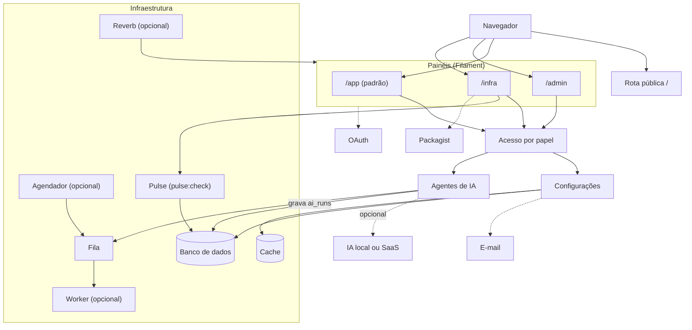
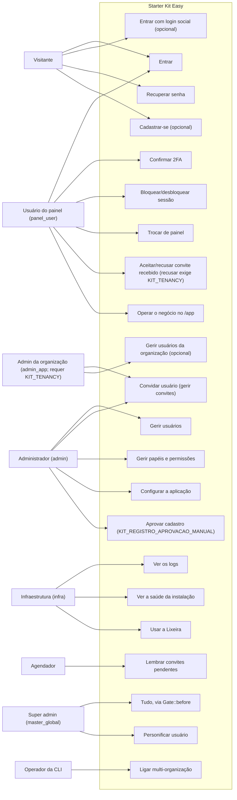
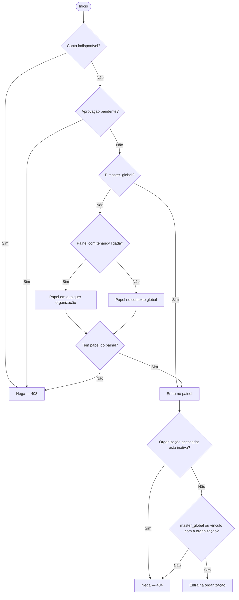
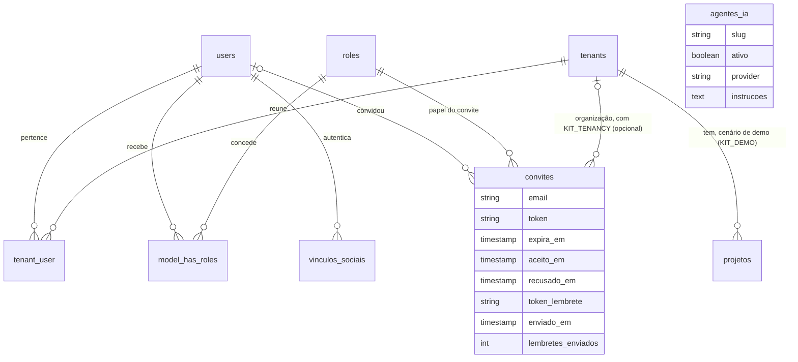

Vinte diagramas Mermaid mostram como o kit funciona hoje: arquitetura, acesso por papel, autenticação, IA, infraestrutura, modelo de dados e o ciclo de vida do próprio kit. Cada um é guardado por um teste automatizado (`tests/Kit/DiagramasDaArquiteturaTest.php`, `tests/Kit/GuardasDosDiagramasTest.php` e, no modo multi-organização, `tests/Tenancy/DiagramasDaArquiteturaTenancyTest.php`) que falha quando o código deixar de bater com o que o diagrama descreve — nenhum diagrama aqui descreve funcionalidade planejada.

## DG-01 — Arquitetura em camadas

Do navegador aos três painéis Filament (`app/Providers/Filament/AppPanelProvider.php:id:79`, `app/Providers/Filament/AdminPanelProvider.php:id:69`, `app/Providers/Filament/InfraPanelProvider.php:id:90`), pelo acesso por papel, até banco, fila, cache e os serviços opcionais. É o mesmo bloco do README — a fonte é única.

## DG-02 — Casos de uso por papel

Os oito atores do kit (visitante, `panel_user`, `admin_app`, `admin`, `infra`, `master_global`, o agendador e a CLI) e os casos de uso que cada papel alcança. `admin_app` só existe com `KIT_TENANCY` ligada (`database/seeders/PapeisSeeder.php:papel:80`); os demais papéis nascem sempre (`database/seeders/PapeisSeeder.php:papel:58`, `:papel:61`, `:papel:101`). Cada aresta liga o papel à entidade de permissão que ele de fato tem no banco (Shield) — ou, para `master_global`, ao código que o libera sem Shield: `Gate::before` (`cu_tudo`) e, para "Personificar usuário", `User::canImpersonate()` (`app/Models/User.php:canImpersonate:882`), que só aceita `master_global` — não a uma suposição.

## DG-03 — Regra de acesso ao painel

A ordem exata de `User::canAccessPanel()` (`app/Models/User.php:canAccessPanel:157`): indisponibilidade da conta (`:166`), aprovação pendente (`:193`), `master_global` (`:206`), contexto do papel — qualquer organização com tenancy, só o contexto global sem ela (`:217`) — e por fim o papel do painel (`:219`). Depois de permitido, a extensão de `User::canAccessTenant()` (`:789`) decide a organização, e a ORDEM importa: organização inativa nega primeiro, para todo mundo — inclusive `master_global` (`:813`) —; só então `master_global` entra sempre (`:826`), e sem vínculo nega (`:830`).

## DG-13 — ER do núcleo

As entidades centrais e como se referenciam: a conta (`users`) a uma organização via `tenant_user` (`app/Models/User.php:tenants:778`, `app/Models/Tenant.php:users:118`), a um papel via `model_has_roles` (Shield), o vínculo social (`app/Models/User.php:vinculosSociais:788`), o convite — com `convidado_por_id` anulável (`database/migrations/2026_08_13_000002_create_convites_table.php:convidado_por_id:42`) — via `papel()`, `tenant()` e `convidadoPor()` (`app/Models/Convite.php:papel:116`, `:tenant:122`, `:convidadoPor:128`) e o catálogo de agentes de IA — sem relação nenhuma com `projetos`, a tabela de demonstração (`app/Traits/BelongsToTenant.php:tenant:82`). `ai_runs` e `agent_conversations` ficam de fora deste ER: guardam identificadores como texto solto (`subject_type`/`subject_id`, `participant_type`/`participant_id`), sem chave estrangeira de verdade, e desenhar uma relação para eles inventaria uma FK que o schema não tem. `passkeys` fica de fora pelo motivo oposto: a tabela existe (vendor), mas nenhuma feature do kit a usa — as passkeys estão desligadas (`enablePasskeys()` não é chamado).

## Sobre a origem destes diagramas

O [GitDiagram](https://gitdiagram.com/gsferro/filament-starter-kit-easy) gerou uma primeira leitura deste repositório por IA — é uma visão gerada por IA, não verificada. O diagrama oficial é este, que a corrige e amplia: o GitDiagram apresentava como sempre-presente o que é opcional (organizações, tenancy) e omitia a regra central do kit (acesso por papel).

## Índice dos 20 diagramas

| DG | Diagrama | Página |
|---|---|---|
| DG-01 | Arquitetura em camadas | Nesta página |
| DG-02 | Casos de uso por papel | Nesta página |
| DG-03 | Regra de acesso ao painel | Nesta página |
| DG-04 | Login por senha e segundo fator | [Autenticação](../../autenticacao/) |
| DG-05 | Login unificado — destino por 0, 1 ou N painéis | [Login unificado](../../autenticacao/login-unificado/) |
| DG-06 | Retorno do login social | [Login social](../../autenticacao/login-social/) |
| DG-07 | Convite, do envio ao aceite | [Convites](../../autenticacao/convites/) |
| DG-08 | Estados da conta do usuário | [Estados de usuário](../../autenticacao/estados-de-usuario/) |
| DG-09 | Estados do convite | [Convites](../../autenticacao/convites/) |
| DG-10 | Sessão autenticada | [Autenticação](../../autenticacao/) |
| DG-11 | Sequência do assistente de IA | [Roteiro de features](../../operacao/roteiro-de-features/) |
| DG-12 | Mapa do /infra: tela, fonte e quem grava | [Trilhas de infraestrutura](../../recursos/trilhas-de-infraestrutura/) |
| DG-13 | ER do núcleo | Nesta página |
| DG-14 | De onde vem a configuração | [Configurações do kit](../../recursos/configuracoes-do-kit/) |
| DG-15 | Sequência da instalação | [Instalação avançada](../../comecar/instalacao-avancada/) |
| DG-16 | Fluxo do kit:update | [Atualizando o projeto](../../comecar/atualizando-o-projeto/) |
| DG-17 | As duas rotas de entrega | [Atualizando o projeto](../../comecar/atualizando-o-projeto/) |
| DG-18 | Containers por profile do Docker | [Instalação avançada](../../comecar/instalacao-avancada/) |
| DG-19 | Segundo plano - composer dev x Docker Compose x agendador | [Desenvolvendo o kit](../../operacao/desenvolvendo-o-kit/) |
| DG-20 | Requisição em /app/{tenant} | [Multi-tenancy](../../recursos/multi-tenancy/) |
